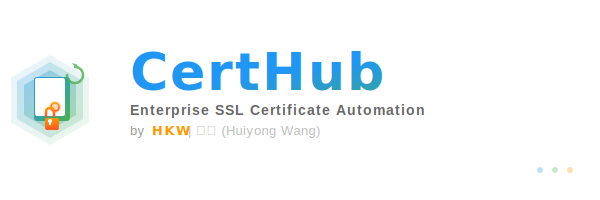
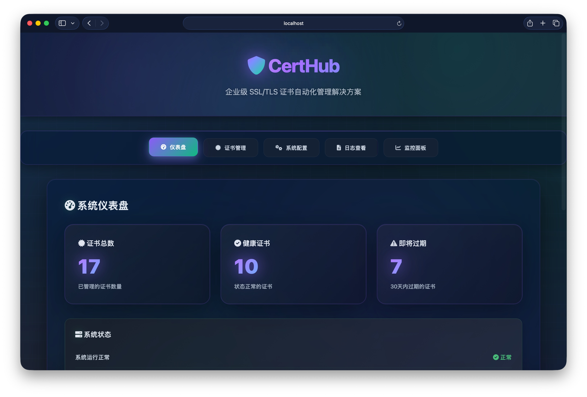

# CertHub - Enterprise SSL Certificate Automation Platform

<div align="center">



[](LICENSE)
[](https://www.docker.com/)
[](https://letsencrypt.org/)
[](CHANGELOG.md)
[](https://github.com/huiyonghkw)

**企业级 SSL/TLS 证书自动化管理解决方案**

基于 Docker 容器化、ACME 协议和多云 DNS API 的证书全生命周期管理系统

</div>

## 📋 概述

**CertHub** 是一个功能完整的企业级 SSL/TLS 证书管理平台，通过 ACME 协议（Let's Encrypt）实现证书的自动申请、部署、续期和监控。系统采用 Docker 容器化架构，支持阿里云、腾讯云、华为云等主流 DNS 提供商，能够轻松管理数百个域名的证书生命周期。

### 🎯 核心价值

- **自动化管理**：消除手动证书管理的复杂性和人为错误，节省 90% 的运维时间
- **多云统一接入**：无缝对接阿里云、腾讯云、华为云 DNS API，统一管理多云环境
- **安全可靠**：采用完整证书链部署，确保微信小程序、移动应用等场景的兼容性
- **易于扩展**：支持多服务器批量部署，单系统可管理 100+ 域名证书
- **实时监控**：自动监控证书状态，提前 30 天发送过期提醒，避免服务中断

### 主要功能

- 🔐 **自动生成** SSL 证书（单域名/泛域名）
- 🚀 **自动部署** 证书到远程服务器
- 🔄 **自动续期** 即将过期的证书
- 📊 **状态监控** 和告警通知
- 🛡️ **安全备份** 和恢复功能
- 🌐 **Web 管理界面** 和 RESTful API
- 🔗 **证书链验证** 确保微信小程序兼容

### 支持的协议和技术栈

**核心协议**：

- **ACME v2** - Let's Encrypt 自动化证书管理协议
- **DNS-01 验证** - 支持泛域名证书申请
- **SSH/SCP** - 安全的远程证书部署
- **REST API** - Web 管理界面和自动化集成

**支持的 DNS 提供商**：

- ✅ 阿里云 DNS (Alibaba Cloud)
- ✅ 腾讯云 DNS (Tencent Cloud)
- ✅ 华为云 DNS (Huawei Cloud)
- 🔄 可扩展支持更多 DNS 服务商

**证书类型和加密算法**：

- **ECC 证书** - 椭圆曲线加密，性能优异（推荐）
- **RSA 证书** - RSA 2048/4096 位，兼容性好（默认）
- **单域名证书** - 单个域名独立证书
- **泛域名证书** - 覆盖所有子域名 (`*.example.com`)

## 📑 目录

- [项目简介](#-概述)
- [核心功能](#-核心功能特性详解)
- [技术架构](#-技术架构与组件)
- [快速开始](#-快速开始)
- [配置指南](#-配置指南)
- [使用示例](#-使用示例)
- [Web 管理界面](#-web-管理界面)
- [API 接口](#-api-接口)
- [实战案例](#-实战案例)
- [故障排除](#-故障排除)
- [更新日志](#-更新日志)
- [贡献指南](#-贡献指南)
- [许可证](#-许可证)

---

## 🌟 核心功能特性详解

### 证书管理功能矩阵

| 功能模块     | 子功能       | 说明                                  | 状态        |
| ------------ | ------------ | ------------------------------------- | ----------- |
| **证书申请** | 单域名证书   | 为单个域名申请独立证书                | ✅ 完全支持 |
|              | 泛域名证书   | 一次申请覆盖所有子域名 `*.domain.com` | ✅ 完全支持 |
|              | 批量生成     | 一键生成所有配置的证书                | ✅ 完全支持 |
|              | ECC/RSA 选择 | 支持 ECC 和 RSA 两种加密算法          | ✅ 完全支持 |
| **证书部署** | SSH 自动部署 | 通过 SSH 自动部署证书到远程服务器     | ✅ 完全支持 |
|              | 多服务器部署 | 同一证书部署到多台服务器              | ✅ 完全支持 |
|              | 自定义目录   | 灵活配置每个域名的部署目录            | ✅ 完全支持 |
|              | 手动部署模式 | 支持 CDN 等需要手动上传的场景         | ✅ 完全支持 |
|              | 证书链验证   | 自动验证证书链完整性                  | ✅ 完全支持 |
| **证书续期** | 自动续期     | 到期前 30 天自动续期                  | ✅ 完全支持 |
|              | 手动续期     | 支持随时手动触发续期                  | ✅ 完全支持 |
|              | 批量续期     | 一键续期所有即将过期的证书            | ✅ 完全支持 |
| **监控告警** | 状态监控     | 实时监控所有证书状态                  | ✅ 完全支持 |
|              | 过期提醒     | 提前 30/15/7/1 天发送提醒             | ✅ 完全支持 |
|              | 健康检查     | 定期检查系统运行状态                  | ✅ 完全支持 |
|              | 多渠道通知   | 邮件/钉钉/Webhook/Slack               | ✅ 完全支持 |
| **Web 管理** | 仪表盘       | 证书统计、状态概览                    | ✅ 完全支持 |
|              | 证书管理     | 在线生成、续期、下载、删除            | ✅ 完全支持 |
|              | 配置管理     | 在线编辑域名、DNS、服务器配置         | ✅ 完全支持 |
|              | 日志查看     | 实时查看证书管理日志                  | ✅ 完全支持 |
| **安全功能** | 完整证书链   | 确保微信小程序兼容                    | ✅ 完全支持 |
|              | 自动备份     | 部署前自动备份旧证书                  | ✅ 完全支持 |
|              | 权限控制     | 证书文件权限自动设置                  | ✅ 完全支持 |
|              | SSH 密钥认证 | 支持免密登录                          | ✅ 完全支持 |

### DNS 提供商支持

| DNS 提供商     | ACME 类型         | 环境变量                                       | 泛域名支持 | 测试状态    |
| -------------- | ----------------- | ---------------------------------------------- | ---------- | ----------- |
| **阿里云 DNS** | `dns_ali`         | `Ali_Key`, `Ali_Secret`                        | ✅         | ✅ 生产验证 |
| **腾讯云 DNS** | `dns_dp`          | `DP_Id`, `DP_Key`                              | ✅         | ✅ 生产验证 |
| **华为云 DNS** | `dns_huaweicloud` | `HUAWEICLOUD_Username`, `HUAWEICLOUD_Password` | ✅         | ✅ 支持     |
| **其他 DNS**   | 可扩展            | -                                              | -          | 🔄 可定制   |

### 自动化任务

| 任务     | 执行时间     | 功能                                 |
| -------- | ------------ | ------------------------------------ |
| 证书监控 | 每日 02:00   | 监控所有证书过期状态，发送告警       |
| 自动续期 | 每日 03:00   | 自动续期即将过期的证书（30 天内）    |
| 状态报告 | 每日 11:00   | 生成并发送证书状态报告               |
| 清理备份 | 每周日 04:00 | 清理过期日志和备份文件（保留 90 天） |

---

## 🏗️ 技术架构与组件

### 系统架构图

```
╔═════════════════════════════════════════════════════════════════════════════╗
║                     SSL 证书自动化管理系统架构                                 ║
╠═════════════════════════════════════════════════════════════════════════════╣
║                                                                             ║
║                          ┌─────────────────────┐                           ║
║                          │   Prometheus 监控    │                           ║
║                          │   (Port 9090)       │                           ║
║                          └──────────┬──────────┘                           ║
║                                     │                                       ║
║                                     ▼                                       ║
║  ╔═══════════════════════════════════════════════════════════════════╗    ║
║  ║            🎯 证书管理核心引擎 (cert-manager.sh)                   ║    ║
║  ╠═══════════════════════════════════════════════════════════════════╣    ║
║  ║                                                                   ║    ║
║  ║  📋 证书生命周期管理                                               ║    ║
║  ║    • generate        单域名证书生成                               ║    ║
║  ║    • generate-all    批量证书生成                                 ║    ║
║  ║    • deploy          单域名证书部署                               ║    ║
║  ║    • deploy-all      批量证书部署                                 ║    ║
║  ║    • renew           单域名证书续期                               ║    ║
║  ║    • renew-all       批量证书续期                                 ║    ║
║  ║                                                                   ║    ║
║  ║  📊 监控与告警                                                     ║    ║
║  ║    • status          证书状态查询                                 ║    ║
║  ║    • monitor         过期监控告警                                 ║    ║
║  ║    • notify          多渠道通知                                   ║    ║
║  ║                                                                   ║    ║
║  ║  🔧 运维工具                                                       ║    ║
║  ║    • backup          证书备份                                     ║    ║
║  ║    • restore         证书恢复                                     ║    ║
║  ║    • cleanup         日志清理                                     ║    ║
║  ║                                                                   ║    ║
║  ╚═══════════════════════════════════════════════════════════════════╝    ║
║                ┌──────────────┴─────────────┐                             ║
║                │                            │                             ║
║         ┌──────▼──────┐              ┌──────▼──────┐                      ║
║         │ 🔐 ACME 引擎 │              │ 📡 部署引擎  │                      ║
║         └──────┬──────┘              └──────┬──────┘                      ║
║                │                            │                             ║
║       ┌────────┴────────┐          ┌────────┴────────┐                    ║
║       │                 │          │                 │                    ║
║  ┌────▼────┐     ┌──────▼─────┐   │   ┌──────────┐  │                    ║
║  │ ACME.sh │     │  DNS APIs  │   │   │ SSH/SCP  │  │                    ║
║  │ (Let's  │     │  ┌───────┐ │   │   │ (Remote  │  │                    ║
║  │ Encrypt)│     │  │ 阿里云 │ │   │   │ Deploy)  │  │                    ║
║  └────┬────┘     │  ├───────┤ │   │   └────┬─────┘  │                    ║
║       │          │  │ 腾讯云 │ │   │        │        │                    ║
║       │          │  ├───────┤ │   │        │        │                    ║
║       │          │  │ 华为云 │ │   │        │        │                    ║
║       │          │  └───────┘ │   │        │        │                    ║
║       │          └──────┬─────┘   │        │        │                    ║
║       │                 │         │        │        │                    ║
║       └─────────────────┴─────────┴────────┴────────┘                    ║
║                              │                                            ║
║  ┌───────────────────────────▼──────────────────────────────────┐        ║
║  │                    🌐 外部服务和资源                           │        ║
║  ├───────────────────────────────────────────────────────────────┤        ║
║  │  • Let's Encrypt CA        • DNS Provider API                │        ║
║  │  • Remote Target Servers   • Notification Services           │        ║
║  │  • Prometheus Exporter     • Cron Job Scheduler              │        ║
║  └───────────────────────────────────────────────────────────────┘        ║
║                                                                           ║
╠═══════════════════════════════════════════════════════════════════════════╣
║                          💾 数据存储层                                     ║
╠═══════════════════════════════════════════════════════════════════════════╣
║  📁 /config         YAML 配置文件                                         ║
║     ├─ domains.yml          域名配置 (泛域名/子域名/自定义)                ║
║     ├─ dns-providers.yml    DNS 提供商凭证 (阿里云/腾讯云/华为云)          ║
║     ├─ servers.yml          目标服务器配置 (SSH/路径/权限)                 ║
║     └─ notify.yml           通知配置 (邮件/企业微信/钉钉)                  ║
║                                                                           ║
║  📁 /data/certs     证书存储目录                                          ║
║     ├─ domain_ecc/          ECC 证书 (推荐,更安全高效)                    ║
║     └─ domain/              RSA 证书 (兼容模式)                           ║
║                                                                           ║
║  📁 /data/logs      日志文件                                              ║
║     ├─ cert-manager.log     证书管理操作日志                              ║
║     ├─ error.log            错误日志                                      ║
║     └─ cron.log             定时任务日志                                  ║
║                                                                           ║
║  📁 /data/backups   备份文件                                              ║
║     ├─ local/               本地备份 (自动/手动)                          ║
║     └─ remote/              远程备份 (目标服务器)                         ║
║                                                                           ║
╚═══════════════════════════════════════════════════════════════════════════╝
```

### 核心组件说明

| 组件             | 技术栈        | 功能                                           |
| ---------------- | ------------- | ---------------------------------------------- |
| **证书管理引擎** | Bash, acme.sh | 核心证书生命周期管理(生成/部署/续期/监控/备份) |
| **ACME 引擎**    | acme.sh       | Let's Encrypt 证书申请和 DNS-01 验证           |
| **部署引擎**     | SSH/SCP       | 远程服务器证书部署和配置更新                   |
| **监控服务**     | Prometheus    | 系统性能监控和证书状态告警                     |
| **工具脚本**     | Bash, Python  | 日志记录、通知推送、备份恢复、清理维护         |
| **定时任务**     | Cron          | 自动化任务调度(每日监控/续期/报告/周清理)      |

### 目录结构

```
acme/
├── README.md                    # 项目文档
├── docker-compose.yml           # Docker编排配置
├── Dockerfile                   # 容器镜像构建文件
│
├── config/                      # 配置文件目录
│   ├── domains.yml.example      # 域名配置模板
│   ├── dns-providers.yml.example# DNS提供商配置模板
│   ├── servers.yml.example      # 服务器配置模板
│   └── notify.yml.example       # 通知配置模板
│
├── scripts/                     # 脚本目录
│   ├── cert-manager.sh          # 主证书管理脚本(1360行)
│   ├── cert-manager-simple.sh   # 简化版状态查看脚本
│   ├── install.sh               # 安装脚本
│   └── utils/                   # 工具脚本
│       ├── logger.sh            # 日志工具
│       ├── notify.sh            # 通知工具
│       └── backup.sh            # 备份工具
│
├── web/                         # Web界面
│   ├── index.html               # 主页面
│   ├── api_server.py            # Flask API服务器(755行)
│   ├── manual-domains.html      # 手动域名管理页面
│   └── start_server.sh          # 启动脚本
│
├── monitoring/                  # 监控配置
│   └── prometheus.yml           # Prometheus配置
│
└── data/                        # 数据目录(运行时生成)
    ├── certs/                   # 证书存储
    │   ├── domain.com_ecc/      # ECC证书
    │   └── domain.com/          # RSA证书
    ├── logs/                    # 日志文件
    │   ├── cert-manager.log     # 主日志
    │   ├── cert-manager-error.log# 错误日志
    │   └── cron.log             # 定时任务日志
    └── backups/                 # 备份文件
        ├── local/               # 本地备份
        └── remote_*/            # 远程备份
```

---

## 🚀 快速开始

### 1. 环境要求

| 项目               | 要求                | 说明                 |
| ------------------ | ------------------- | -------------------- |
| **Docker**         | >= 20.10            | 容器运行环境         |
| **Docker Compose** | >= 2.0              | 容器编排工具         |
| **域名 DNS**       | API 访问权限        | 阿里云/腾讯云/华为云 |
| **服务器 SSH**     | 免密登录            | 用于证书部署         |
| **操作系统**       | Linux/macOS/Windows | 支持 Docker 即可     |
| **磁盘空间**       | >= 1GB              | 证书和日志存储       |

### 2. 安装部署

#### 步骤 1：克隆项目

```bash
# 克隆仓库
git clone https://github.com/yourusername/acme-ssl-manager.git
cd acme-ssl-manager/acme

# 检查目录结构
ls -la
```

#### 步骤 2：配置 SSH 免密登录

```bash
# 生成SSH密钥（如果还没有）
ssh-keygen -t rsa -b 4096 -f ~/.ssh/id_rsa

# 复制公钥到目标服务器
ssh-copy-id root@your-server-ip

# 测试连接
ssh root@your-server-ip "echo 'SSH连接成功'"
```

#### 步骤 3：启动系统

```bash
# 启动服务
docker-compose up -d

# 检查服务状态
docker-compose ps

# 验证系统健康
docker exec acme-ssl-manager /scripts/cert-manager-simple.sh health-check
```

### 3. 基本配置

#### 配置 DNS 提供商

```bash
# 复制配置模板
cp config/dns-providers.yml.example config/dns-providers.yml

# 编辑配置（填入你的 API 密钥）
nano config/dns-providers.yml
```

**阿里云配置示例：**

```yaml
dns_providers:
  aliyun:
    env_vars:
      Ali_Key: "你的阿里云AccessKey"
      Ali_Secret: "你的阿里云Secret"
```

#### 配置域名

```bash
# 复制配置模板
cp config/domains.yml.example config/domains.yml

# 编辑配置
nano config/domains.yml
```

**单域名配置示例：**

```yaml
domains:
  - domain: example.com
    subdomains:
      - api.example.com
    dns_provider: aliyun
    servers:
      - server_main
    auto_renew: true
```

#### 配置服务器

```bash
# 复制配置模板
cp config/servers.yml.example config/servers.yml

# 编辑配置
nano config/servers.yml
```

**服务器配置示例：**

```yaml
servers:
  server_main:
    host: "192.168.1.100"
    user: "root"
    ssl_dir: "/opt/docker/nginx/ssl"
    reload_cmd: "docker restart nginx"
```

### 4. 证书操作

#### 生成证书

```bash
# 生成单个域名证书
docker exec acme-ssl-manager /scripts/cert-manager.sh generate api.example.com

# 生成泛域名证书
docker exec acme-ssl-manager /scripts/cert-manager.sh generate "*.example.com"

# 生成所有配置的证书
docker exec acme-ssl-manager /scripts/cert-manager.sh generate-all
```

#### 部署证书

```bash
# 部署到指定服务器
docker exec acme-ssl-manager /scripts/cert-manager.sh deploy api.example.com server_main

# 部署所有证书（自动跳过 deploy_method: manual 的域名）
docker exec acme-ssl-manager /scripts/cert-manager.sh deploy-all

# 查看需要手动处理的域名
docker exec acme-ssl-manager /scripts/cert-manager.sh list-manual
```

#### 续期证书

```bash
# 续期单个证书
docker exec acme-ssl-manager /scripts/cert-manager.sh renew api.example.com

# 续期所有即将过期的证书
docker exec acme-ssl-manager /scripts/cert-manager.sh renew-all
```

#### 查看状态

```bash
# 查看所有证书状态
docker exec acme-ssl-manager /scripts/cert-manager.sh status-all

# 查看单个证书状态
docker exec acme-ssl-manager /scripts/cert-manager.sh status api.example.com

# 生成并发送证书状态报告
docker exec acme-ssl-manager /scripts/cert-manager.sh report

# 系统健康检查
docker exec acme-ssl-manager /scripts/cert-manager-simple.sh health-check
```

**🔍 状态检查说明**：

- 系统自动检测 ECC 和 RSA 证书格式
- 智能解析证书过期时间，兼容不同日期格式
- 错误容错机制确保所有域名都被检查
- 支持泛域名证书和单域名证书混合管理

## 📝 配置指南

本节详细介绍系统的所有配置文件及其参数说明。

### 1. DNS 提供商配置 (`config/dns-providers.yml`)

DNS 提供商配置文件用于存储各个 DNS 服务商的 API 凭证信息。

#### 配置文件结构

```yaml
dns_providers:
  provider_id: # DNS提供商唯一标识符
    provider_name: "" # 提供商名称（显示用）
    acme_dns_type: "" # ACME.sh DNS类型
    api_endpoint: "" # API端点地址
    credentials: # API凭证
      access_key_id: "" # 访问密钥ID
      access_key_secret: "" # 访问密钥Secret
      region: "" # 区域设置（可选）
    env_vars: # ACME.sh环境变量映射
      VAR_NAME: "value" # 环境变量键值对
    options: # 配置选项
      ttl: 600 # DNS记录TTL（秒）
      timeout: 30 # API请求超时时间（秒）
      max_retries: 3 # 最大重试次数
      retry_interval: 10 # 重试间隔（秒）
```

#### 阿里云 DNS 配置示例

```yaml
dns_providers:
  aliyun:
    provider_id: aliyun
    provider_name: "阿里云DNS"
    acme_dns_type: dns_ali
    api_endpoint: "https://alidns.aliyuncs.com"
    credentials:
      access_key_id: ""
      access_key_secret: "your_aliyun"
      region: "cn-hangzhou"
    env_vars:
      Ali_Key: ""
      Ali_Secret: "your_aliyun"
    options:
      ttl: 600
      timeout: 30
      max_retries: 3
      retry_interval: 10
```

#### 腾讯云 DNS 配置示例

```yaml
dns_providers:
  tencent:
    provider_id: tencent
    provider_name: "腾讯云DNS"
    acme_dns_type: dns_dp
    api_endpoint: "https://dnspod.tencentcloudapi.com"
    credentials:
      secret_id: "583967"
      secret_key: "ddfdec56413daf3f29921ef0db3bdd4c"
      region: "ap-beijing"
    env_vars:
      DP_Id: "583967"
      DP_Key: "ddfdec56413daf3f29921ef0db3bdd4c"
    options:
      ttl: 600
      timeout: 30
      max_retries: 3
      retry_interval: 10
```

#### 参数说明

| 参数                     | 必填 | 说明                                          |
| ------------------------ | ---- | --------------------------------------------- |
| `provider_id`            | ✅   | DNS 提供商唯一标识符，用于域名配置中引用      |
| `provider_name`          | ✅   | 提供商显示名称                                |
| `acme_dns_type`          | ✅   | ACME.sh 支持的 DNS 类型（如 dns_ali, dns_dp） |
| `api_endpoint`           | ⚪   | API 端点地址（某些提供商需要）                |
| `credentials`            | ✅   | API 认证凭证                                  |
| `env_vars`               | ✅   | ACME.sh 所需的环境变量映射                    |
| `options.ttl`            | ⚪   | DNS 记录生存时间，默认 600 秒                 |
| `options.timeout`        | ⚪   | API 请求超时时间，默认 30 秒                  |
| `options.max_retries`    | ⚪   | API 请求最大重试次数，默认 3 次               |
| `options.retry_interval` | ⚪   | 重试间隔时间，默认 10 秒                      |

#### 安全注意事项

1. **文件权限**: 设置为 `600` 或 `400`，确保只有所有者可读

   ```bash
   chmod 600 config/dns-providers.yml
   ```

2. **版本控制**: 不要将包含真实密钥的文件提交到 Git

   ```bash
   # .gitignore 中已包含
   config/dns-providers.yml
   ```

3. **密钥轮换**: 建议定期更换 API 密钥

4. **环境变量**: 生产环境可使用环境变量代替硬编码

### 2. 域名配置 (`config/domains.yml`)

域名配置文件定义需要管理的域名及其证书配置。

#### 配置文件结构

```yaml
domains:
  - domain: "" # 主域名
    subdomains: # 子域名列表
      - domain: "" # 子域名（扩展格式）
        deploy_dir: "" # 部署目录（可选）
        cert_filename: "" # 证书文件名（可选）
        key_filename: "" # 私钥文件名（可选）
        deploy_method: "" # 部署方式: auto/manual（可选）
    wildcard: true/false # 是否申请泛域名证书
    dns_provider: "" # DNS提供商ID
    servers: [] # 目标服务器列表
    cert_type: "" # 证书类型: wildcard/single
    auto_renew: true/false # 是否自动续期
    renew_before_days: 30 # 提前续期天数
    description: "" # 域名描述
```

#### 完整配置示例

```yaml
domains:
  # 示例1: 基础泛域名配置
  - domain: example.com
    subdomains:
      - api.example.com
      - www.example.com
    wildcard: true
    dns_provider: aliyun
    servers:
      - server_main
    cert_type: wildcard
    auto_renew: true
    renew_before_days: 30
    description: "示例域名SSL证书"

  # 示例2: 高级自定义配置
  - domain: advanced.com
    subdomains:
      - domain: api.advanced.com
        deploy_dir: api.advanced.com
        cert_filename: fullchain.cer
        key_filename: advanced.com.key
        deploy_method: auto
      - domain: static.advanced.com
        deploy_method: manual # CDN手动上传
    wildcard: true
    dns_provider: aliyun
    servers:
      - server_main
      - server_backup
    cert_type: wildcard
    auto_renew: true
    renew_before_days: 30
    description: "高级配置示例"

# 全局默认配置
global:
  default_deploy_method: auto
  default_cert_type: wildcard
  default_auto_renew: true
  default_renew_before_days: 30
```

#### 参数详细说明

| 参数                         | 类型    | 必填 | 默认值     | 说明                                    |
| ---------------------------- | ------- | ---- | ---------- | --------------------------------------- |
| `domain`                     | String  | ✅   | -          | 主域名（如 example.com）                |
| `subdomains`                 | Array   | ✅   | -          | 子域名列表（字符串或对象）              |
| `subdomains[].domain`        | String  | ✅   | -          | 子域名完整名称                          |
| `subdomains[].deploy_dir`    | String  | ⚪   | 子域名     | 证书部署目录名                          |
| `subdomains[].cert_filename` | String  | ⚪   | domain.cer | 证书文件名                              |
| `subdomains[].key_filename`  | String  | ⚪   | domain.key | 私钥文件名                              |
| `subdomains[].deploy_method` | String  | ⚪   | auto       | 部署方式（auto/manual）                 |
| `wildcard`                   | Boolean | ⚪   | false      | 是否申请泛域名证书                      |
| `dns_provider`               | String  | ✅   | -          | DNS 提供商 ID（来自 dns-providers.yml） |
| `servers`                    | Array   | ✅   | -          | 目标服务器 ID 列表                      |
| `cert_type`                  | String  | ⚪   | single     | 证书类型（wildcard/single）             |
| `auto_renew`                 | Boolean | ⚪   | true       | 是否自动续期                            |
| `renew_before_days`          | Integer | ⚪   | 30         | 提前续期天数                            |
| `description`                | String  | ⚪   | -          | 域名用途描述                            |

#### 配置最佳实践

1. **泛域名优先**: 对于有多个子域名的情况，推荐使用泛域名证书
2. **合理分组**: 将相关域名归为同一组配置
3. **环境区分**: 使用 `description` 标注环境（生产/测试/开发）
4. **手动部署标记**: CDN 域名设置 `deploy_method: manual`

### 3. 服务器配置 (`config/servers.yml`)

服务器配置文件定义证书部署的目标服务器信息。

#### 配置文件结构

```yaml
servers:
  - server_id: "" # 服务器唯一标识符
    host: "" # 服务器IP或域名
    port: 22 # SSH端口
    user: "" # SSH用户名
    ssh_key_path: "" # SSH私钥路径
    ssl_cert_dir: "" # SSL证书存储目录
    nginx_container: "" # Nginx容器名称
    nginx_reload_cmd: "" # Nginx重启命令
    backup_dir: "" # 证书备份目录
    connection_timeout: 10 # 连接超时时间（秒）
    max_retry: 3 # 最大重试次数
    description: "" # 服务器描述
    environment: "" # 环境标识: production/staging/development
```

#### 完整配置示例

```yaml
servers:
  # 生产服务器示例
  - server_id: server_prod_001
    host: 192.168.1.100
    port: 22
    user: root
    ssh_key_path: ~/.ssh/id_rsa
    ssl_cert_dir: /opt/docker/nginx/ssl
    nginx_container: nginx
    nginx_reload_cmd: docker restart nginx
    backup_dir: /opt/docker/nginx/ssl/backups
    connection_timeout: 10
    max_retry: 3
    description: "主要生产服务器"
    environment: production

  # 使用系统nginx的服务器
  - server_id: server_prod_002
    host: 192.168.1.200
    port: 22
    user: root
    ssh_key_path: ~/.ssh/id_rsa
    ssl_cert_dir: /etc/nginx/ssl
    nginx_container: nginx # 系统nginx
    nginx_reload_cmd: nginx -t && nginx -s reload
    backup_dir: /etc/nginx/ssl/backups
    connection_timeout: 10
    max_retry: 3
    description: "系统Nginx服务器"
    environment: production

# 全局服务器配置
global:
  ssh:
    ssh_options:
      - "-o ConnectTimeout=10"
      - "-o BatchMode=yes"
      - "-o StrictHostKeyChecking=accept-new"
    scp_options:
      - "-q"
      - "-o ConnectTimeout=10"

  cert_permissions:
    key_file: "600" # 私钥文件权限
    cert_file: "644" # 证书文件权限
    directory: "755" # 目录权限

  pre_deploy_checks:
    - check_ssh_connection
    - check_target_directory
    - check_nginx_config_syntax
    - backup_existing_certs

  post_deploy_checks:
    - verify_cert_files
    - check_nginx_status
    - test_ssl_connection
    - update_cert_database
```

#### 参数详细说明

| 参数                 | 类型    | 必填 | 说明                          |
| -------------------- | ------- | ---- | ----------------------------- |
| `server_id`          | String  | ✅   | 服务器唯一标识符              |
| `host`               | String  | ✅   | 服务器 IP 地址或域名          |
| `port`               | Integer | ⚪   | SSH 端口，默认 22             |
| `user`               | String  | ✅   | SSH 登录用户名                |
| `ssh_key_path`       | String  | ⚪   | SSH 私钥文件路径              |
| `ssl_cert_dir`       | String  | ✅   | 证书部署目录（绝对路径）      |
| `nginx_container`    | String  | ⚪   | Nginx 容器名称（Docker 环境） |
| `nginx_reload_cmd`   | String  | ✅   | 重新加载 Nginx 的命令         |
| `backup_dir`         | String  | ⚪   | 备份文件存储目录              |
| `connection_timeout` | Integer | ⚪   | SSH 连接超时时间（秒）        |
| `max_retry`          | Integer | ⚪   | 部署失败最大重试次数          |
| `description`        | String  | ⚪   | 服务器用途描述                |
| `environment`        | String  | ⚪   | 环境标识                      |

#### SSH 配置注意事项

1. **免密登录配置**:

   ```bash
   # 生成SSH密钥对
   ssh-keygen -t rsa -b 4096 -f ~/.ssh/id_rsa

   # 将公钥复制到目标服务器
   ssh-copy-id -i ~/.ssh/id_rsa.pub user@server-ip

   # 测试SSH连接
   ssh -i ~/.ssh/id_rsa user@server-ip "echo 'SSH连接成功'"
   ```

2. **SSH 密钥权限**:

   ```bash
   chmod 600 ~/.ssh/id_rsa
   chmod 644 ~/.ssh/id_rsa.pub
   ```

3. **Docker 容器路径**: 确保 `ssl_cert_dir` 是容器挂载路径，而非容器内路径

4. **Nginx 重启命令**: 根据实际环境选择合适的重启命令
   - Docker: `docker restart container_name`
   - 系统服务: `systemctl reload nginx`
   - 直接命令: `nginx -s reload`

### 4. 通知配置 (`config/notify.yml`)

通知配置文件定义证书事件的通知方式和渠道。

#### 配置文件结构

```yaml
notifications:
  # 钉钉通知
  dingtalk:
    enabled: true/false
    webhook_url: ""
    access_token: ""
    secret: ""

  # 邮件通知
  email:
    enabled: true/false
    smtp:
      host: ""
      port: 587
      user: ""
      password: ""
      use_tls: true
    from: ""
    to: []

  # Webhook通知
  webhook:
    enabled: true/false
    url: ""
    method: "POST"
    headers: {}
    body: {}

  # Slack通知
  slack:
    enabled: true/false
    webhook_url: ""
    channel: ""
    username: ""

# 通知触发配置
triggers:
  cert_expiry_warning:
    enabled: true
    days_before: [30, 15, 7, 1]
  cert_renewal_success:
    enabled: true
  cert_renewal_failure:
    enabled: true
  deployment_success:
    enabled: true
  deployment_failure:
    enabled: true
  system_error:
    enabled: true
```

#### 完整配置示例

```yaml
notifications:
  dingtalk:
    enabled: true
    webhook_url: "https://oapi.dingtalk.com/robot/send"
    access_token: "your-access-token"
    secret: "your-secret"

  email:
    enabled: true
    smtp:
      host: smtp.gmail.com
      port: 587
      user: ssl-manager@example.com
      password: "your-app-password"
      use_tls: true
    from: "SSL Manager <ssl-manager@example.com>"
    to:
      - admin@example.com
      - ops@example.com

  webhook:
    enabled: false
    url: "https://your-api.com/webhook"
    method: "POST"
    headers:
      Authorization: "Bearer your-token"
      Content-Type: "application/json"
    body:
      event: "{{event_type}}"
      domain: "{{domain}}"
      status: "{{status}}"
      timestamp: "{{timestamp}}"

triggers:
  cert_expiry_warning:
    enabled: true
    days_before: [30, 15, 7, 1]
  cert_renewal_success:
    enabled: true
  cert_renewal_failure:
    enabled: true
  deployment_success:
    enabled: false # 可选关闭成功通知
  deployment_failure:
    enabled: true
  system_error:
    enabled: true
```

#### 测试通知配置

```bash
# 测试所有通知渠道
docker exec acme-ssl-manager /scripts/utils/notify.sh test

# 测试特定通知渠道
docker exec acme-ssl-manager /scripts/utils/notify.sh test dingtalk
docker exec acme-ssl-manager /scripts/utils/notify.sh test email
```

---

## 📊 Web 管理界面

- **证书管理界面**: http://localhost:8080
- **监控面板**: http://localhost:9090

### 🎨 界面预览

CertHub 提供了现代化、美观的 Web 管理界面，采用渐变色设计和玻璃态效果：



**界面特色**：

- 🎨 **现代设计**: 采用深色主题配合紫绿渐变色，科技感十足
- ✨ **玻璃态效果**: 毛玻璃背景和动态光晕，视觉体验出色
- 📱 **响应式布局**: 完美适配桌面端和移动端
- 🎯 **直观仪表盘**: 证书统计、健康状态、过期提醒一目了然
- 🔔 **实时监控**: 证书状态实时更新，到期提醒及时通知
- 💎 **精美动画**: 交互流畅，悬停效果丰富

### 🛠️ Web 管理界面功能

#### 1. 仪表盘（Dashboard）

- 实时显示证书统计信息（总数、健康、即将过期）
- 系统状态监控（ACME 客户端、运行状态）
- 证书过期提醒（30 天内过期预警）
- 精美的数据可视化卡片

#### 2. 证书管理

- 📋 **证书列表**: 表格形式展示所有证书详情
  - 域名、类型（单域名/泛域名）
  - 状态徽章（健康/警告/过期）
  - 过期时间和剩余天数
  - 加密算法（ECC/RSA）
  - 自定义配置标识
- 🔄 **操作功能**:
  - 一键续期证书
  - 下载证书文件（ZIP 格式）
  - 删除过期证书
- ⚙️ **自定义配置**: 查看每个域名的部署配置
  - 部署目录
  - 证书文件名
  - 私钥文件名
- ➕ **添加证书**: 图形化界面添加新域名证书

#### 3. 系统配置

- 🌐 **域名配置**: YAML 格式配置域名和子域名
- 🔌 **DNS 提供商**: 配置阿里云、腾讯云、华为云 API 密钥
- 🖥️ **服务器管理**: 配置证书部署的目标服务器
- 🔔 **通知设置**: 邮件、钉钉等通知渠道配置

#### 4. 日志查看

- 📝 **证书管理日志**: 申请、部署、续期全流程日志
- ⚠️ **错误日志**: 系统异常和错误信息
- ⏰ **定时任务日志**: Cron 任务执行记录
- 🔄 **实时刷新**: 支持手动刷新和清空日志

#### 5. 监控面板

- 📈 **系统运行时间**: 容器持续运行时长
- 🔍 **证书检查记录**: 最近检查时间和下次检查计划
- 📊 **证书更新统计**: 本月更新次数和历史记录
- 💻 **资源使用情况**: CPU、内存、磁盘实时占用
- 🎯 **证书状态分布**: 健康、警告、过期证书分布图
- ✅ **服务健康检查**: ACME 客户端和系统组件状态

### 📱 访问方式

**证书管理界面**：

```bash
http://localhost:8080
```

**Prometheus 监控面板**：

```bash
http://localhost:9090
```

### 🎯 使用建议

1. **定期检查**: 建议每周登录管理界面查看证书状态
2. **提前续期**: 在证书到期前 30 天系统会自动续期
3. **备份证书**: 重要证书建议手动下载备份
4. **监控告警**: 配置邮件或钉钉通知，及时接收到期提醒

### 🔧 自定义域名证书配置

系统支持为每个子域名配置自定义的证书名称和部署目录，并提供灵活的部署方式选择。

#### 配置格式

在 `config/domains.yml` 中，子域名支持两种配置格式：

**1. 简单格式（使用默认配置）：**

```yaml
domains:
  - domain: example.com
    subdomains:
      - api.example.com
      - www.example.com
```

**2. 扩展格式（自定义配置）：**

```yaml
domains:
  - domain: example.com
    subdomains:
      - domain: api.example.com
        deploy_dir: api.example.com # 自定义部署目录
        cert_filename: fullchain.cer # 自定义证书文件名
        key_filename: example.com.key # 自定义私钥文件名
        deploy_method: auto # 部署方式：auto（自动）/manual（手动）
      - domain: www.example.com
        deploy_dir: www.example.com
        cert_filename: fullchain.cer
        key_filename: example.com.key
        deploy_method: auto
      - domain: static.example.com
        deploy_method: manual # 手动上传到CDN（如七牛云）
      - domain: assets.example.com
        deploy_method: manual # 手动上传到CDN（如阿里云CDN）
```

#### 配置参数说明

- **deploy_method**: 证书部署方式 🔧

  - 默认值：`auto`（自动部署到服务器）
  - 可选值：
    - `auto`: 自动部署到配置的服务器
    - `manual`: 手动上传到 CDN（如七牛云、阿里云 CDN 等）
  - 说明：设置为 `manual` 的域名在批量处理时会被自动过滤跳过
  - 示例：`static.example.com`、`assets.example.com` 通常设置为 `manual`
  - 全局默认：可在 `global.default_deploy_method` 中设置

- **deploy_dir**: 证书部署到服务器的目录名称

  - 默认值：使用子域名作为目录名
  - 示例：`api.example.com` 证书默认部署到 `/ssl_cert_dir/api.example.com/`
  - 自定义：可以指定任意目录名，如 `custom-dir`

- **cert_filename**: 证书文件名

  - 默认值：`domain.cer`
  - 推荐值：`fullchain.cer` 或 `domain.pem`
  - 示例：`example.com.cer`, `fullchain.cer`

- **key_filename**: 私钥文件名
  - 默认值：`domain.key`
  - 推荐值：保持统一命名
  - 示例：`example.com.key`, `private.key`

#### 实际使用示例

**域名配置：**

```yaml
domains:
  - domain: example-app.com
    subdomains:
      - domain: www.example-app.com
        deploy_dir: www.example-app.com
        cert_filename: fullchain.cer
        key_filename: example-app.com.key
        deploy_method: auto
      - domain: lightapi.example-app.com
        deploy_dir: lightapi.example-app.com
        cert_filename: fullchain.cer
        key_filename: example-app.com.key
        deploy_method: auto
      - domain: mch.example-app.com
        deploy_dir: mch.example-app.com
        cert_filename: fullchain.cer
        key_filename: example-app.com.key
        deploy_method: auto
    wildcard: true
    dns_provider: aliyun
    servers:
      - server_prod_01
      - server_prod_02
```

**部署效果：**

- 证书部署到：`/opt/docker/nginx/ssl/www.example-app.com/fullchain.cer`
- 私钥部署到：`/opt/docker/nginx/ssl/www.example-app.com/example-app.com.key`
- 证书部署到：`/opt/docker/nginx/ssl/lightapi.example-app.com/fullchain.cer`
- 私钥部署到：`/opt/docker/nginx/ssl/lightapi.example-app.com/example-app.com.key`

#### 特殊应用场景

**1. 多个子域名共享证书文件**

```yaml
domains:
  - domain: domain.com
    subdomains:
      - domain: mall.domain.com
        deploy_dir: mall.domain.com
        cert_filename: fullchain.cer
        key_filename: domain.com.key
        deploy_method: auto
      - domain: wlhy.domain.com
        deploy_dir: domain.com # 与其他子域名共享目录
        cert_filename: fullchain.cer
        key_filename: domain.com.key
        deploy_method: auto
```

**2. 不同证书格式混合使用**

```yaml
domains:
  - domain: ly.domain.com
    subdomains:
      - domain: mall-beta.ly.domain.com
        deploy_dir: ly.domain.com
        cert_filename: ly.domain.com.pem # 使用 .pem 格式
        key_filename: ly.domain.com.key
        deploy_method: auto
      - domain: mall.ly.domain.com
        deploy_dir: mall.ly.domain.com
        cert_filename: fullchain.cer # 使用 .cer 格式
        key_filename: ly.domain.com.key
        deploy_method: auto
```

**3. 混合部署方式（自动+手动）**

```yaml
domains:
  - domain: bshop.example-media.cn
    subdomains:
      - domain: static.bshop.example-media.cn # 静态资源域名
        deploy_method: manual # 手动上传到七牛云CDN
      - domain: m.bshop.example-media.cn # 手机端
        deploy_dir: example-media.cn
        cert_filename: fullchain.cer
        key_filename: example-media.cn.key
        deploy_method: auto # 自动部署到服务器
      - domain: bshop.example-media.cn # 官网
        deploy_dir: bshop.example-media.cn
        cert_filename: fullchain.cer
        key_filename: example-media.cn.key
        deploy_method: auto # 自动部署到服务器
    wildcard: true
    dns_provider: aliyun_hiyamedia
    servers:
      - server_190_164
    cert_type: wildcard
    auto_renew: true
    renew_before_days: 30
    description: "BShop平台SSL证书"
```

#### Web 界面显示

在 Web 管理界面中，证书管理页面会显示每个域名的自定义配置：

1. **证书列表**: 增加"自定义配置"列，显示部署方式标识
2. **配置详情**: 点击"查看配置"按钮可以查看：
   - 部署方式（自动/手动）
   - 部署目录
   - 证书文件名
   - 私钥文件名
3. **配置状态**: 区分使用默认配置和自定义配置的证书
4. **批量操作**: 批量部署时会自动过滤 `deploy_method: manual` 的域名
5. **手动域名管理**: 专门的手动域名管理页面 (`/manual-domains.html`)：
   - 查看所有手动部署域名
   - 下载证书文件
   - 查看 CDN 配置指南（七牛云、阿里云 CDN 等）
   - 证书状态监控

#### 部署命令示例

**自动部署（推荐）：**

```bash
# 系统自动根据配置部署到指定目录和文件名
docker exec acme-ssl-manager /scripts/cert-manager.sh deploy example-app.com server_prod_01
```

**手动部署：**

```bash
# 手动部署到自定义目录
docker exec acme-ssl-manager /scripts/cert-manager.sh deploy example-app.com server_prod_01 www.example-app.com
```

#### 注意事项

1. **配置一致性**: 确保配置文件中的目录和文件名与 nginx 配置一致
2. **权限设置**: 证书文件权限设置为 644，私钥文件权限设置为 600
3. **路径验证**: 部署前验证目标服务器的路径是否存在
4. **备份策略**: 自定义配置会影响备份文件的命名和位置
5. **部署方式**:
   - `deploy_method: auto` 的域名会自动部署到配置的服务器
   - `deploy_method: manual` 的域名需要手动上传到 CDN，批量处理时会被跳过
   - 确保静态资源域名（如 static._ 或 assets._）设置为 `manual`

#### 故障排除

**配置不生效：**

```bash
# 检查配置文件语法
docker exec acme-ssl-manager python3 -c "import yaml; yaml.safe_load(open('/config/domains.yml'))"

# 重新加载配置
docker exec acme-ssl-manager /scripts/cert-manager.sh reload-config
```

**证书文件找不到：**

```bash
# 检查证书文件是否在指定位置
docker exec acme-ssl-manager ls -la /data/certs/domain_ecc/

# 检查部署目录
ssh user@server "ls -la /opt/docker/nginx/ssl/"
```

## 🔧 高级功能

### 最佳实践建议

#### 证书类型选择

- **推荐使用 ECC 证书**: 性能更好，密钥更小，安全性更高
- **泛域名证书**: 推荐用于多子域名场景，管理更便捷
- **自动续期**: 建议所有证书启用自动续期

#### 监控建议

- 定期检查证书状态：`docker exec acme-ssl-manager /scripts/cert-manager.sh status-all`
- 监控系统日志：`docker exec acme-ssl-manager tail -f /data/logs/cert-manager.log`
- 设置过期提醒：系统默认提前 30 天提醒

### 自动化任务

系统已预配置自动化任务：

- **每日凌晨 2 点**: 监控证书过期状态
- **每日凌晨 3 点**: 自动续期即将过期的证书
- **每日上午 11 点**: 检查证书状态并发送报告
- **每周日凌晨 4 点**: 清理过期日志和备份

### 备份和恢复

```bash
# 备份所有证书
docker exec acme-ssl-manager /scripts/utils/backup.sh backup all

# 恢复证书
docker exec acme-ssl-manager /scripts/utils/backup.sh restore local api.example.com

# 清理过期备份
docker exec acme-ssl-manager /scripts/utils/backup.sh cleanup 90
```

### 通知配置

支持多种通知方式：

- 邮件通知
- 钉钉通知
- Webhook 通知
- Slack 通知
- 短信通知

#### 配置通知

```bash
# 复制通知配置模板
cp config/notify.yml.example config/notify.yml

# 编辑通知配置
nano config/notify.yml
```

**钉钉通知配置示例：**

```yaml
notifications:
  dingtalk:
    enabled: true
    webhook_url: "https://oapi.dingtalk.com/robot/send"
    access_token: "your-access-token"
    secret: "your-secret"
```

**邮件通知配置示例：**

```yaml
notifications:
  email:
    enabled: true
    smtp:
      host: smtp.gmail.com
      port: 587
      user: your-email@gmail.com
      password: your-email-password
    from: ssl-manager@example.com
    to:
      - admin@example.com
```

**测试通知功能：**

```bash
# 测试所有通知方式
docker exec acme-ssl-manager /scripts/utils/notify.sh test

# 测试特定通知方式
docker exec acme-ssl-manager /scripts/utils/notify.sh test dingtalk
```

## 🔌 API 接口文档

系统提供完整的 REST API 接口，支持证书管理、配置管理、日志查看等功能。

### API 基础信息

- **Base URL**: `http://localhost:5000/api`
- **Content-Type**: `application/json`
- **认证**: 无（内网使用）

### 1. 仪表盘接口

#### 获取仪表盘统计数据

```
GET /api/dashboard
```

**响应示例**:

```json
{
  "totalCerts": 12,
  "healthyCerts": 10,
  "expiringCerts": 2,
  "systemStatus": {
    "healthy": true,
    "message": "系统运行正常",
    "timestamp": "2025-07-15T10:30:00"
  }
}
```

### 2. 证书管理接口

#### 获取证书列表

```
GET /api/certificates
```

**响应示例**:

```json
{
  "success": true,
  "certificates": [
    {
      "domain": "example.com",
      "type": "wildcard",
      "algorithm": "ECC",
      "expiryDate": "2025-10-10",
      "daysRemaining": 87,
      "status": "healthy",
      "custom_configs": {
        "api.example.com": {
          "deploy_dir": "api.example.com",
          "cert_filename": "fullchain.cer",
          "key_filename": "example.com.key",
          "deploy_method": "auto"
        }
      }
    }
  ]
}
```

#### 生成证书

```
POST /api/certificates
Content-Type: application/json
```

**请求参数**:

| 参数        | 类型   | 必填 | 说明                                            |
| ----------- | ------ | ---- | ----------------------------------------------- |
| domain      | String | ✅   | 域名                                            |
| certType    | String | ⚪   | 证书类型: `wildcard` 或 `single`，默认 `single` |
| dnsProvider | String | ⚪   | DNS 提供商，默认 `aliyun`                       |

**请求示例**:

```json
{
  "domain": "example.com",
  "certType": "wildcard",
  "dnsProvider": "aliyun"
}
```

**响应示例**:

```json
{
  "success": true,
  "message": "证书生成成功"
}
```

#### 续期证书

```
POST /api/certificates/{domain}/renew
```

**路径参数**:

- `domain`: 域名

**响应示例**:

```json
{
  "success": true,
  "message": "证书续期成功"
}
```

#### 删除证书

```
DELETE /api/certificates/{domain}
```

**路径参数**:

- `domain`: 域名

**响应示例**:

```json
{
  "success": true,
  "message": "证书删除成功"
}
```

#### 下载证书

```
GET /api/certificates/{domain}/download
```

**路径参数**:

- `domain`: 域名

**响应**: ZIP 文件流

### 3. 手动部署域名接口

#### 获取手动部署域名列表

```
GET /api/certificates/manual
```

**响应示例**:

```json
{
  "domains": [
    {
      "domain": "static.example.com",
      "parent_domain": "example.com",
      "deploy_method": "manual",
      "cert_exists": true,
      "expires": "2025-10-10",
      "status": "healthy",
      "cert_dir": "/data/certs/example.com_ecc",
      "description": "手动部署域名 - static.example.com"
    }
  ]
}
```

#### 下载手动部署域名证书

```
GET /api/certificates/manual/{domain}/download
```

**路径参数**:

- `domain`: 手动部署的域名

**响应**: ZIP 文件流

### 4. 配置管理接口

#### 获取配置

```
GET /api/config/{config_type}
```

**路径参数**:

- `config_type`: 配置类型
  - `domains`: 域名配置
  - `dns`: DNS 提供商配置
  - `servers`: 服务器配置
  - `notification`: 通知配置

**响应示例**:

```json
{
  "content": "domains:\n  - domain: example.com\n    ..."
}
```

#### 保存配置

```
POST /api/config/{config_type}
Content-Type: application/json
```

**路径参数**:

- `config_type`: 配置类型（同上）

**请求参数**:

```json
{
  "content": "domains:\n  - domain: example.com\n    ..."
}
```

**响应示例**:

```json
{
  "success": true,
  "message": "配置保存成功"
}
```

### 5. 日志管理接口

#### 获取日志

```
GET /api/logs/{log_type}
```

**路径参数**:

- `log_type`: 日志类型
  - `cert-manager`: 证书管理日志
  - `error`: 错误日志
  - `cron`: 定时任务日志

**响应示例**:

```json
{
  "content": "[2025-07-15 10:30:00] [INFO] 证书生成成功: example.com\n..."
}
```

#### 清空日志

```
DELETE /api/logs/{log_type}
```

**路径参数**:

- `log_type`: 日志类型（同上）

**响应示例**:

```json
{
  "success": true,
  "message": "日志清空成功"
}
```

### 6. 监控接口

#### 获取监控数据

```
GET /api/monitoring
```

**响应示例**:

```json
{
  "uptime": "up 5 days, 3:42",
  "lastCheck": "2025-07-15 10:00:00",
  "certUpdates": 25,
  "charts": {}
}
```

### 7. 健康检查接口

#### 健康检查

```
GET /health
```

**响应示例**:

```json
{
  "status": "ok",
  "timestamp": "2025-07-15T10:30:00",
  "version": "1.0.0"
}
```

### API 使用示例

#### cURL 示例

**获取证书列表**:

```bash
curl -X GET http://localhost:5000/api/certificates
```

**生成证书**:

```bash
curl -X POST http://localhost:5000/api/certificates \
  -H "Content-Type: application/json" \
  -d '{
    "domain": "example.com",
    "certType": "wildcard",
    "dnsProvider": "aliyun"
  }'
```

**续期证书**:

```bash
curl -X POST http://localhost:5000/api/certificates/example.com/renew
```

**下载证书**:

```bash
curl -X GET http://localhost:5000/api/certificates/example.com/download \
  -o example.com_certificate.zip
```

#### Python 示例

```python
import requests
import json

# API基础URL
BASE_URL = "http://localhost:5000/api"

# 获取证书列表
def get_certificates():
    response = requests.get(f"{BASE_URL}/certificates")
    return response.json()

# 生成证书
def create_certificate(domain, cert_type="wildcard", dns_provider="aliyun"):
    data = {
        "domain": domain,
        "certType": cert_type,
        "dnsProvider": dns_provider
    }
    response = requests.post(
        f"{BASE_URL}/certificates",
        headers={"Content-Type": "application/json"},
        data=json.dumps(data)
    )
    return response.json()

# 续期证书
def renew_certificate(domain):
    response = requests.post(f"{BASE_URL}/certificates/{domain}/renew")
    return response.json()

# 下载证书
def download_certificate(domain, output_file):
    response = requests.get(f"{BASE_URL}/certificates/{domain}/download")
    with open(output_file, 'wb') as f:
        f.write(response.content)

# 使用示例
if __name__ == "__main__":
    # 获取证书列表
    certs = get_certificates()
    print(f"总证书数: {len(certs['certificates'])}")

    # 生成新证书
    result = create_certificate("example.com", "wildcard", "aliyun")
    print(f"生成结果: {result['message']}")

    # 续期证书
    result = renew_certificate("example.com")
    print(f"续期结果: {result['message']}")

    # 下载证书
    download_certificate("example.com", "example.com_cert.zip")
    print("证书下载完成")
```

#### JavaScript/Node.js 示例

```javascript
const axios = require("axios");
const fs = require("fs");

const BASE_URL = "http://localhost:5000/api";

// 获取证书列表
async function getCertificates() {
  const response = await axios.get(`${BASE_URL}/certificates`);
  return response.data;
}

// 生成证书
async function createCertificate(
  domain,
  certType = "wildcard",
  dnsProvider = "aliyun"
) {
  const response = await axios.post(`${BASE_URL}/certificates`, {
    domain,
    certType,
    dnsProvider,
  });
  return response.data;
}

// 续期证书
async function renewCertificate(domain) {
  const response = await axios.post(`${BASE_URL}/certificates/${domain}/renew`);
  return response.data;
}

// 下载证书
async function downloadCertificate(domain, outputFile) {
  const response = await axios.get(
    `${BASE_URL}/certificates/${domain}/download`,
    {
      responseType: "stream",
    }
  );

  const writer = fs.createWriteStream(outputFile);
  response.data.pipe(writer);

  return new Promise((resolve, reject) => {
    writer.on("finish", resolve);
    writer.on("error", reject);
  });
}

// 使用示例
(async () => {
  try {
    // 获取证书列表
    const certs = await getCertificates();
    console.log(`总证书数: ${certs.certificates.length}`);

    // 生成新证书
    const createResult = await createCertificate(
      "example.com",
      "wildcard",
      "aliyun"
    );
    console.log(`生成结果: ${createResult.message}`);

    // 续期证书
    const renewResult = await renewCertificate("example.com");
    console.log(`续期结果: ${renewResult.message}`);

    // 下载证书
    await downloadCertificate("example.com", "example.com_cert.zip");
    console.log("证书下载完成");
  } catch (error) {
    console.error("错误:", error.message);
  }
})();
```

### 错误处理

#### 错误响应格式

```json
{
  "success": false,
  "message": "错误描述信息"
}
```

#### HTTP 状态码

| 状态码 | 说明           |
| ------ | -------------- |
| 200    | 请求成功       |
| 400    | 请求参数错误   |
| 404    | 资源不存在     |
| 500    | 服务器内部错误 |

### API 安全建议

1. **内网访问**: 默认配置仅允许内网访问，不对外暴露
2. **认证机制**: 生产环境建议添加认证中间件
3. **HTTPS**: 生产环境建议使用 HTTPS
4. **请求限流**: 建议配置 API 请求限流
5. **日志审计**: 记录所有 API 操作日志

---

## 📖 详细实战指南

### 完整的域名证书部署流程

以泛域名 `example-project.com` 为例，演示从配置到部署的完整流程：

#### 步骤 1：系统健康检查

```bash
# 检查服务状态
docker-compose ps

# 验证系统健康
docker exec acme-ssl-manager /scripts/cert-manager-simple.sh health-check
```

#### 步骤 2：确认配置文件

**DNS 提供商配置** (`config/dns-providers.yml`)：

```yaml
dns_providers:
  aliyun:
    provider_id: aliyun
    provider_name: "阿里云DNS"
    acme_dns_type: dns_ali
    env_vars:
      Ali_Key: "你的阿里云AccessKey"
      Ali_Secret: "你的阿里云Secret"
```

**域名配置** (`config/domains.yml`)：

```yaml
domains:
  - domain: example-project.com
    subdomains:
      - api.example-project.com
    wildcard: true
    dns_provider: aliyun
    servers:
      - server_prod_02
    cert_type: wildcard
    auto_renew: true
    renew_before_days: 30
    description: "政策通办平台SSL证书"
```

**服务器配置** (`config/servers.yml`)：

```yaml
servers:
  - server_id: server_prod_02
    host: 203.0.113.10
    user: root
    ssl_cert_dir: /opt/docker/nginx/ssl
    nginx_container: nginx
    nginx_reload_cmd: docker restart nginx
    connection_timeout: 10
    description: "主要生产服务器"
```

#### 步骤 3：生成证书

```bash
# 生成泛域名证书
docker exec acme-ssl-manager bash -c '
export Ali_Key="你的阿里云AccessKey" &&
export Ali_Secret="你的阿里云Secret" &&
/scripts/cert-manager.sh generate example-project.com'

# 检查生成的证书
docker exec acme-ssl-manager ls -la /data/certs/example-project.com_ecc/

# 验证证书域名覆盖
docker exec acme-ssl-manager openssl x509 -in /data/certs/example-project.com_ecc/example-project.com.cer -text -noout | grep -A 2 "Subject Alternative Name"
```

#### 步骤 4：手动部署证书（推荐）

虽然系统提供自动化部署功能，但手动部署可以更好地控制过程：

```bash
# 1. 测试SSH连接
docker exec acme-ssl-manager ssh -o ConnectTimeout=10 -o BatchMode=yes root@203.0.113.10 "echo 'SSH连接测试成功'"

# 2. 创建目标目录
docker exec acme-ssl-manager ssh -o ConnectTimeout=10 -o BatchMode=yes root@203.0.113.10 "mkdir -p /opt/docker/nginx/ssl/api.example-project.com"

# 3. 备份现有证书
docker exec acme-ssl-manager ssh -o ConnectTimeout=10 -o BatchMode=yes root@203.0.113.10 "
cd /opt/docker/nginx/ssl/api.example-project.com &&
if [ -f example-project.com.cer ]; then
  cp example-project.com.cer example-project.com.cer.backup.\$(date +%Y%m%d%H%M%S)
fi &&
if [ -f example-project.com.key ]; then
  cp example-project.com.key example-project.com.key.backup.\$(date +%Y%m%d%H%M%S)
fi"

# 4. 上传新证书
docker exec acme-ssl-manager scp -o ConnectTimeout=10 -o BatchMode=yes /data/certs/example-project.com_ecc/example-project.com.cer root@203.0.113.10:/opt/docker/nginx/ssl/api.example-project.com/

docker exec acme-ssl-manager scp -o ConnectTimeout=10 -o BatchMode=yes /data/certs/example-project.com_ecc/example-project.com.key root@203.0.113.10:/opt/docker/nginx/ssl/api.example-project.com/

# 5. 设置正确权限
docker exec acme-ssl-manager ssh -o ConnectTimeout=10 -o BatchMode=yes root@203.0.113.10 "
chmod 644 /opt/docker/nginx/ssl/api.example-project.com/example-project.com.cer &&
chmod 600 /opt/docker/nginx/ssl/api.example-project.com/example-project.com.key"

# 6. 验证文件上传
docker exec acme-ssl-manager ssh -o ConnectTimeout=10 -o BatchMode=yes root@203.0.113.10 "ls -la /opt/docker/nginx/ssl/api.example-project.com/"
```

#### 步骤 5：重启服务并验证

```bash
# 1. 测试nginx配置
docker exec acme-ssl-manager ssh -o ConnectTimeout=10 -o BatchMode=yes root@203.0.113.10 "docker exec nginx nginx -t"

# 2. 重启nginx容器
docker exec acme-ssl-manager ssh -o ConnectTimeout=10 -o BatchMode=yes root@203.0.113.10 "docker restart nginx"

# 3. 检查容器状态
docker exec acme-ssl-manager ssh -o ConnectTimeout=10 -o BatchMode=yes root@203.0.113.10 "docker ps | grep nginx"

# 4. 验证SSL证书
docker exec acme-ssl-manager ssh -o ConnectTimeout=10 -o BatchMode=yes root@203.0.113.10 "echo | openssl s_client -connect api.example-project.com:443 -servername api.example-project.com 2>/dev/null | openssl x509 -noout -subject -issuer -dates"

# 5. 测试HTTPS连接
docker exec acme-ssl-manager ssh -o ConnectTimeout=10 -o BatchMode=yes root@203.0.113.10 "curl -I -k https://api.example-project.com --connect-timeout 10"
```

#### 步骤 6：配置自动更新

**方法 1：使用内置定时任务**

系统已预配置自动化任务，无需额外配置：

- 每日凌晨 2 点：监控证书过期状态
- 每日凌晨 3 点：自动续期即将过期的证书
- 每日上午 11 点：检查证书状态并发送报告
- 每周日凌晨 4 点：清理过期日志和备份

**方法 2：自定义定时任务**

如需自定义，可在目标服务器上添加定时任务：

```bash
# 在目标服务器上添加cron任务
# 每月1号凌晨2点自动更新证书
0 2 1 * * /usr/local/bin/cert-update.sh example-project.com

# 创建更新脚本
cat > /usr/local/bin/cert-update.sh << 'EOF'
#!/bin/bash
DOMAIN="$1"
LOG_FILE="/var/log/cert-update.log"

echo "[$(date)] 开始更新证书: $DOMAIN" >> $LOG_FILE

# 这里可以调用ACME系统的API或执行远程命令
# 或者接收来自ACME系统推送的新证书

echo "[$(date)] 证书更新完成: $DOMAIN" >> $LOG_FILE
EOF

chmod +x /usr/local/bin/cert-update.sh
```

**方法 3：使用 Webhook 通知**

配置证书更新成功后的自动通知：

```yaml
# 在 config/notify.yml 中配置
notifications:
  webhook:
    url: "https://your-api.com/cert-updated"
    method: "POST"
    headers:
      Authorization: "Bearer your-token"
    body:
      domain: "{{domain}}"
      status: "{{status}}"
      expires: "{{expires}}"
```

#### 验证结果

成功部署后，你应该看到：

1. **证书信息验证**：

   ```
   subject= /CN=example-project.com
   issuer= /C=US/O=Let's Encrypt/CN=E6
   notBefore=Jul 12 04:05:12 2025 GMT
   notAfter=Oct 10 04:05:11 2025 GMT
   ```

2. **域名覆盖确认**：

   ```
   X509v3 Subject Alternative Name:
       DNS:*.example-project.com, DNS:example-project.com
   ```

3. **HTTPS 响应正常**：
   ```
   HTTP/1.1 200 OK
   Server: nginx
   ```

### 单域名 vs 泛域名选择

**泛域名证书** (推荐)：

- ✅ 覆盖所有子域名 (`*.example.com`)
- ✅ 管理简单，一个证书管理多个服务
- ✅ 成本效益高
- ❌ 安全性稍低（一个私钥对应多个域名）

**单域名证书**：

- ✅ 安全性更高（每个域名独立私钥）
- ✅ 影响范围小
- ❌ 管理复杂（需要为每个子域名申请证书）
- ❌ 证书数量多

### 最佳实践建议

1. **初次部署**：

   - 先在测试环境验证完整流程
   - 确认 nginx 配置文件路径正确
   - 测试 SSH 连接和权限

2. **生产环境**：

   - 使用泛域名证书简化管理
   - 设置自动备份和恢复机制
   - 配置监控和告警

3. **安全考虑**：

   - 定期轮换 API 密钥
   - 限制 SSH 访问权限
   - 监控证书使用情况

4. **维护管理**：
   - 定期检查证书过期时间
   - 清理过期的备份文件
   - 更新系统组件

## 🚨 故障排除

### 常见问题

#### 1. DNS API 认证失败

```bash
# 检查配置
docker exec acme-ssl-manager cat /config/dns-providers.yml

# 测试连接
docker exec acme-ssl-manager /scripts/cert-manager.sh test-dns aliyun
```

#### 2. 证书生成失败

```bash
# 查看日志
docker exec acme-ssl-manager tail -f /data/logs/cert-manager.log

# 检查域名解析
docker exec acme-ssl-manager nslookup api.example.com
```

#### 3. 证书部署失败

```bash
# 检查 SSH 连接
docker exec acme-ssl-manager ssh -o ConnectTimeout=10 root@target-server "echo 'SSH OK'"

# 检查目标目录
ssh root@target-server "ls -la /opt/docker/nginx/ssl/"
```

#### 4. 服务重启失败

```bash
# 检查 nginx 配置
ssh root@target-server "nginx -t"

# 查看容器状态
ssh root@target-server "docker ps | grep nginx"
```

### 日志查看

```bash
# 实时查看日志
docker exec acme-ssl-manager tail -f /data/logs/cert-manager.log

# 查看错误日志
docker exec acme-ssl-manager tail -f /data/logs/cert-manager-error.log

# 搜索特定错误
docker exec acme-ssl-manager grep "ERROR" /data/logs/cert-manager.log
```

## 📋 配置示例参考

### 示例 1：政策通办域名（已测试成功）

**域名配置**：

```yaml
domains:
  - domain: example-project.com
    subdomains:
      - api.example-project.com
    wildcard: true
    dns_provider: aliyun
    servers:
      - server_prod_02
    cert_type: wildcard
    auto_renew: true
    renew_before_days: 30
    description: "政策通办平台SSL证书"
```

**服务器配置**：

```yaml
servers:
  - server_id: server_prod_02
    host: 203.0.113.10
    user: root
    ssl_cert_dir: /opt/docker/nginx/ssl
    nginx_reload_cmd: docker restart nginx
```

**部署命令**：

```bash
# 生成泛域名证书
docker exec acme-ssl-manager bash -c 'export Ali_Key="你的Key" && export Ali_Secret="你的Secret" && /scripts/cert-manager.sh generate example-project.com'

# 手动部署（推荐）
# 1. 创建目录
docker exec acme-ssl-manager ssh root@203.0.113.10 "mkdir -p /opt/docker/nginx/ssl/api.example-project.com"

# 2. 上传证书
docker exec acme-ssl-manager scp /data/certs/example-project.com_ecc/example-project.com.cer root@203.0.113.10:/opt/docker/nginx/ssl/api.example-project.com/
docker exec acme-ssl-manager scp /data/certs/example-project.com_ecc/example-project.com.key root@203.0.113.10:/opt/docker/nginx/ssl/api.example-project.com/

# 3. 重启服务
docker exec acme-ssl-manager ssh root@203.0.113.10 "docker restart nginx"
```

### 示例 2：CC 招车域名配置

**域名配置**：

```yaml
domains:
  - domain: example-app.com
    subdomains:
      - www.example-app.com
      - lightapi.example-app.com
      - pre.example-app.com
      - mch.example-app.com
      - fapiao.example-app.com
    wildcard: true
    dns_provider: aliyun
    servers:
      - server_prod_01
      - server_prod_02
    cert_type: wildcard
    auto_renew: true
    renew_before_days: 30
    description: "平台SSL证书"
```

**部署到多服务器**：

```bash
# 生成证书
docker exec acme-ssl-manager bash -c 'export Ali_Key="你的Key" && export Ali_Secret="你的Secret" && /scripts/cert-manager.sh generate example-app.com'

# 部署到第一台服务器
docker exec acme-ssl-manager scp /data/certs/example-app.com_ecc/example-app.com.cer root@203.0.113.20:/mnt/nginx/cert/
docker exec acme-ssl-manager scp /data/certs/example-app.com_ecc/example-app.com.key root@203.0.113.20:/mnt/nginx/cert/
docker exec acme-ssl-manager ssh root@203.0.113.20 "nginx -s reload"

# 部署到第二台服务器
docker exec acme-ssl-manager scp /data/certs/example-app.com_ecc/example-app.com.cer root@203.0.113.10:/opt/docker/nginx/ssl/example-app/
docker exec acme-ssl-manager scp /data/certs/example-app.com_ecc/example-app.com.key root@203.0.113.10:/opt/docker/nginx/ssl/example-app/
docker exec acme-ssl-manager ssh root@203.0.113.10 "docker restart nginx"
```

### 示例 3：腾讯云 DNS 域名配置

**DNS 提供商配置**：

```yaml
dns_providers:
  tencent:
    provider_id: tencent
    provider_name: "腾讯云DNS"
    acme_dns_type: dns_dp
    env_vars:
      DP_Id: "你的腾讯云SecretId"
      DP_Key: "你的腾讯云SecretKey"
```

**域名配置**：

```yaml
domains:
  - domain: example-business.com
    subdomains:
      - api.app.example-business.com
      - service.example-business.com
      - host.example-business.com
    wildcard: true
    dns_provider: tencent
    servers:
      - server_190_164
      - server_108_14_117
    cert_type: wildcard
    auto_renew: true
    renew_before_days: 30
    description: "Higgses平台SSL证书"
```

**部署命令**：

```bash
# 使用腾讯云DNS生成证书
docker exec acme-ssl-manager bash -c 'export DP_Id="你的Id" && export DP_Key="你的Key" && /scripts/cert-manager.sh generate example-business.com'
```

### 应用到其他域名的通用步骤

基于上述成功经验，更新其他域名证书的通用流程：

#### 1. 修改配置文件

**添加新域名到 `config/domains.yml`**：

```yaml
domains:
  # 添加你的新域名
  - domain: your-domain.com
    subdomains:
      - api.your-domain.com
      - www.your-domain.com
    wildcard: true # 推荐使用泛域名
    dns_provider: aliyun # 或 tencent
    servers:
      - your_server_id
    cert_type: wildcard
    auto_renew: true
    renew_before_days: 30
    description: "你的域名SSL证书"
```

**添加服务器配置到 `config/servers.yml`**：

```yaml
servers:
  - server_id: your_server_id
    host: your.server.ip
    user: root
    ssl_cert_dir: /path/to/your/ssl/dir
    nginx_container: your-nginx-container
    nginx_reload_cmd: docker restart your-nginx-container
    connection_timeout: 10
    description: "你的服务器"
```

#### 2. 生成证书

```bash
# 替换为你的域名和API密钥
docker exec acme-ssl-manager bash -c '
export Ali_Key="你的阿里云AccessKey" &&
export Ali_Secret="你的阿里云Secret" &&
/scripts/cert-manager.sh generate your-domain.com'
```

#### 3. 部署证书

```bash
# 1. 测试连接
docker exec acme-ssl-manager ssh root@your.server.ip "echo 'SSH测试成功'"

# 2. 创建目录
docker exec acme-ssl-manager ssh root@your.server.ip "mkdir -p /path/to/your/ssl/dir"

# 3. 备份现有证书
docker exec acme-ssl-manager ssh root@your.server.ip "
cd /path/to/your/ssl/dir &&
if [ -f your-domain.com.cer ]; then
  cp your-domain.com.cer your-domain.com.cer.backup.\$(date +%Y%m%d%H%M%S)
fi"

# 4. 上传新证书
docker exec acme-ssl-manager scp /data/certs/your-domain.com_ecc/your-domain.com.cer root@your.server.ip:/path/to/your/ssl/dir/
docker exec acme-ssl-manager scp /data/certs/your-domain.com_ecc/your-domain.com.key root@your.server.ip:/path/to/your/ssl/dir/

# 5. 设置权限
docker exec acme-ssl-manager ssh root@your.server.ip "
chmod 644 /path/to/your/ssl/dir/your-domain.com.cer &&
chmod 600 /path/to/your/ssl/dir/your-domain.com.key"

# 6. 重启服务
docker exec acme-ssl-manager ssh root@your.server.ip "docker restart your-nginx-container"
```

#### 4. 验证部署

```bash
# 验证证书
docker exec acme-ssl-manager ssh root@your.server.ip "echo | openssl s_client -connect your-domain.com:443 -servername your-domain.com 2>/dev/null | openssl x509 -noout -subject -dates"

# 测试HTTPS
docker exec acme-ssl-manager ssh root@your.server.ip "curl -I -k https://your-domain.com --connect-timeout 10"
```

### 批量更新所有域名

当你配置好所有域名后，可以使用以下命令批量操作：

```bash
# 生成所有配置的证书（包括 deploy_method: manual 的域名）
docker exec acme-ssl-manager /scripts/cert-manager.sh generate-all

# 部署所有证书（自动跳过 deploy_method: manual 的域名）
docker exec acme-ssl-manager /scripts/cert-manager.sh deploy-all

# 查看所有证书状态
docker exec acme-ssl-manager /scripts/cert-manager.sh status-all

# 续期所有即将过期的证书
docker exec acme-ssl-manager /scripts/cert-manager.sh renew-all

# 查看需要手动处理的域名
docker exec acme-ssl-manager /scripts/cert-manager.sh list-manual
```

#### 🔧 批量处理行为说明

- **证书生成**: 所有域名的证书都会生成，不受 `deploy_method` 影响
- **证书部署**: 只有 `deploy_method: auto` 的域名会自动部署，`deploy_method: manual` 的域名会被跳过
- **手动处理**: 设置为 `manual` 的域名需要手动下载证书并上传到相应的 CDN 平台

#### 🔍 手动域名处理

对于 `deploy_method: manual` 的域名，需要手动处理：

**1. 查看手动域名列表**：

```bash
# 查看所有需要手动处理的域名
docker exec acme-ssl-manager /scripts/cert-manager.sh list-manual
```

**2. 下载证书文件**：

```bash
# 方法1：使用容器内路径
docker exec acme-ssl-manager cp /data/certs/static.example.com_ecc/fullchain.cer /tmp/
docker exec acme-ssl-manager cp /data/certs/static.example.com_ecc/static.example.com.key /tmp/

# 方法2：直接从容器中导出证书
docker cp acme-ssl-manager:/data/certs/static.example.com_ecc/fullchain.cer ./
docker cp acme-ssl-manager:/data/certs/static.example.com_ecc/static.example.com.key ./
```

**3. 手动上传到 CDN 平台**：

根据具体 CDN 平台的操作界面完成上传：

- **七牛云 CDN**: 控制台 → 域名管理 → SSL 证书 → 上传证书
- **阿里云 CDN**: 控制台 → 域名管理 → HTTPS 配置 → 修改配置
- **腾讯云 CDN**: 控制台 → 域名管理 → 高级配置 → HTTPS 配置

**4. 使用 Web 管理界面**：

通过 Web 界面 http://localhost:8080 管理手动域名：

- 查看手动域名列表
- 下载证书文件
- 查看 CDN 配置指南

## 🔧 系统架构

```
acme/
├── README.md                 # 本文档
├── docker-compose.yml        # 服务配置
├── Dockerfile                # 镜像构建
├── config/                   # 配置文件
│   ├── *.yml.example        # 配置模板
│   └── *.yml                # 实际配置（git忽略）
├── scripts/                  # 核心脚本
│   ├── cert-manager.sh      # 完整版证书管理
│   ├── cert-manager-simple.sh  # 简化版状态查看
│   └── utils/               # 工具脚本
├── data/                     # 运行时数据（git忽略）
│   ├── certs/              # 证书文件
│   ├── logs/               # 日志文件
│   └── backups/            # 备份文件
├── web/                     # Web界面
└── monitoring/              # 监控配置
```

## 🔧 系统特性

### 证书格式支持

系统支持多种证书格式：

- **ECC 证书** (推荐): 性能更好，密钥更小
- **RSA 证书**: 兼容性更好

证书文件自动存储在：

- ECC 证书: `/data/certs/domain.com_ecc/`
- RSA 证书: `/data/certs/domain.com/`

### 状态检查优化

- 自动检测证书类型（ECC/RSA）
- 智能日期格式解析，兼容不同系统
- 错误容错机制，确保所有域名都被检查

### 兼容性改进

- 支持 BusyBox 环境的日期命令
- 自动处理 OpenSSL 日期格式转换
- 增强的错误处理和日志记录

## 🔧 证书链完整性保障

### 新增功能：证书链验证

为防止 SSL 证书信任问题（如微信小程序验证失败），系统现在包含完整的证书链验证功能：

#### 1. 自动验证机制

**部署时自动验证**：

```bash
# 部署证书时自动验证证书链
docker exec acme-ssl-manager /scripts/cert-manager.sh deploy example-project.com server_prod_02
```

部署过程会自动：

- ✅ 验证本地证书链完整性
- ✅ 确保使用 `fullchain.cer`（完整证书链）
- ✅ 验证远程部署后的证书链
- ✅ 检查证书可信度

#### 2. 手动验证命令

**验证所有域名的证书链**：

```bash
# 检查所有域名的证书链状态
docker exec acme-ssl-manager /scripts/cert-manager.sh verify-chains
```

**输出示例**：

```
📋 SSL证书链完整性验证报告
━━━━━━━━━━━━━━━━━━━━━━━━━━━━━━━━━━━━━━━━━━━━━━━━━━━━━━━━━━━━━━━━━━━━━━━━━━━━━━━━━━━━━━━━━━━━━━━━━━━━━━━━
✅ example-project.com: 完整证书链 (2 个证书) - fullchain.cer
   📅 过期时间: Oct 10 04:05:11 2025 GMT

⚠️  example.com: 不完整证书链 (1 个证书) - example.com.cer
   📝 建议: 使用 fullchain.cer 文件包含完整证书链

📊 统计结果:
• 总域名数: 12
• 完整证书链: 7
• 不完整证书链: 0
• 缺失证书: 5
```

#### 3. 证书链重要性

**完整证书链的必要性**：

- 🔐 **微信小程序兼容性**：微信小程序需要完整证书链验证
- 🔐 **移动端应用支持**：iOS/Android 应用需要完整证书链
- 🔐 **浏览器兼容性**：确保所有浏览器都能验证证书
- 🔐 **API 客户端支持**：第三方 API 客户端需要完整证书链

**证书链结构**：

```
完整证书链 (fullchain.cer):
1. 服务器证书 (你的域名证书)
2. 中间证书 (Let's Encrypt 中间CA)
3. 根证书 (Let's Encrypt 根CA, 可选)
```

#### 4. 修复不完整证书链

如果发现证书链不完整：

**方法 1：重新生成证书**

```bash
# 重新生成证书（自动包含完整证书链）
docker exec acme-ssl-manager /scripts/cert-manager.sh generate example-project.com
```

**方法 2：重新部署现有证书**

```bash
# 重新部署（确保使用fullchain.cer）
docker exec acme-ssl-manager /scripts/cert-manager.sh deploy example-project.com server_prod_02
```

**方法 3：手动修复**

```bash
# 1. 备份现有证书
cp example-project.com.cer example-project.com.cer.backup

# 2. 使用完整证书链
cp fullchain.cer example-project.com.cer

# 3. 重启服务
docker restart nginx
```

#### 5. 验证修复结果

**测试证书链**：

```bash
# 检查证书链数量
echo | openssl s_client -connect api.example-project.com:443 -showcerts 2>/dev/null | grep -c 'BEGIN CERTIFICATE'
# 结果应该是 2 或更多

# 检查证书信任
echo | openssl s_client -connect api.example-project.com:443 -verify_return_error 2>/dev/null | grep "Verify return code"
# 结果应该是 "Verify return code: 0 (ok)"
```

**微信小程序测试**：

- 在微信开发者工具中测试 API 请求
- 确保不再出现 `ERR_CERT_AUTHORITY_INVALID` 错误

### 🚨 故障排除

## 📋 更新日志

### v1.2.0 (2025-07-15)

**重大修复**:

- 🔧 **修复 DNS 环境变量设置问题**：修复 `setup_dns_provider_env` 函数中的正则表达式，原来的 `^[A-Z_]+:` 无法匹配包含数字的环境变量名（如 `DP_Id`、`DP_Key`、`Ali_Key`），现已修复为 `^[A-Za-z_][A-Za-z0-9_]*:`
- 🛠️ **解决 ARM64 架构兼容性问题**：在 ARM64 宿主机（如 Apple Silicon Mac）上运行 x86_64 容器时，OpenSSL 的 ECC 密钥生成会出现"Illegal instruction"错误，现已默认使用 RSA 2048 位密钥确保兼容性
- ⚡ **修复强制更新选项**：修复 `--force` 和 `-f` 参数解析和传递问题

**新增特性**:

- ✅ 支持 `ACME_KEY_TYPE` 环境变量控制密钥类型（rsa/ecc）
- ✅ 新增调试日志，显示环境变量设置和密钥类型选择
- ✅ 智能密钥类型选择，默认使用 RSA 确保最佳兼容性

**性能优化**:

- ⚡ 改进证书生成稳定性，避免架构相关的崩溃
- ⚡ 优化错误处理和调试信息输出
- ⚡ 增强多平台兼容性

**部署成果**:

- 🎉 成功修复 `your.domain.com` 泛域名证书生成（腾讯云 DNS）
- 🎉 成功修复 `example-site.com` 泛域名证书生成（阿里云 DNS）
- 🎉 解决了跨架构平台的 SSL 证书生成问题

**故障排除指南**:

```bash
# 如果在ARM64 Mac上遇到"Illegal instruction"错误
# 方案1：使用RSA密钥（推荐）
export ACME_KEY_TYPE=rsa
docker exec acme-ssl-manager /scripts/cert-manager.sh generate 'your-domain.com'

# 方案2：手动指定RSA密钥
docker exec acme-ssl-manager bash -c '
export DP_Id="your_id" &&
export DP_Key="your_key" &&
acme.sh --issue --dns dns_dp -d your-domain.com -d *.your-domain.com --keylength 2048'

# 检查生成的证书
docker exec acme-ssl-manager openssl x509 -in /data/certs/your-domain.com/your-domain.com.cer -text -noout | grep -A 2 "Subject Alternative Name"
```

### v1.1.0 (2025-07-13)

**新增特性**:

- ✅ 支持 ECC 证书自动检测和管理
- ✅ 智能日期格式解析，兼容 BusyBox 环境
- ✅ 增强的错误容错机制
- ✅ 优化的 `status-all` 命令，确保所有域名被检查
- ✅ 新增 your.domain.com 泛域名证书部署案例

**修复问题**:

- 🐛 修复证书路径检测问题（ECC vs RSA）
- 🐛 修复日期格式解析错误
- 🐛 修复 `status-all` 命令被中断的问题
- 🐛 修复 Docker 容器挂载路径混淆问题

**性能优化**:

- ⚡ 改进证书状态检查逻辑
- ⚡ 优化错误处理和日志记录
- ⚡ 增强系统稳定性

**部署成果**:

- 🎉 成功部署 your.domain.com 泛域名证书到 ip 服务器
- 🎉 解决腾讯云 DNS API 配置问题
- 🎉 完善 Docker 挂载路径部署流程

### v1.0.0 (2025-07-12)

**首次发布**:

- 🎉 完整的 SSL 证书自动化管理系统
- 🎉 多 DNS 提供商支持
- 🎉 自动续期和部署功能
- 🎉 Web 管理界面和监控面板

### 腾讯云 DNS - your.domain.com 泛域名证书部署实例

以 `your.domain.com` 泛域名证书为例，演示腾讯云 DNS 的完整部署流程：

#### 步骤 1：DNS 配置验证

**DNS 配置**：

```yaml
domains:
  - domain: your.domain.com
    subdomains:
      - www.your.domain.com
      - admin.your.domain.com
    wildcard: true
    dns_provider: tencent
    servers:
      - server_190_164
    cert_type: wildcard
    auto_renew: true
    renew_before_days: 30
    description: "GYL平台SSL证书"
```

**服务器配置**：

```yaml
servers:
  - server_id: server_190_164
    host: ip
    user: root
    ssl_cert_dir: /opt/docker/nginx/ssl
    nginx_container: nginx
    nginx_reload_cmd: docker restart nginx
```

#### 步骤 2：生成证书

```bash
# 使用腾讯云DNS生成泛域名证书
docker exec acme-ssl-manager bash -c '
export DP_Id="your_tencent_secret_id" &&
export DP_Key="your_tencent_secret_key" &&
/scripts/cert-manager.sh generate your.domain.com'
```

#### 步骤 3：手动部署到服务器

```bash
# 1. 测试SSH连接
docker exec acme-ssl-manager ssh root@ip "echo 'SSH连接成功'"

# 2. 创建证书目录（注意：使用挂载路径）
docker exec acme-ssl-manager ssh root@ip "mkdir -p /opt/docker/nginx/ssl/your.domain.com"

# 3. 备份现有证书
docker exec acme-ssl-manager ssh root@ip "
cd /opt/docker/nginx/ssl/your.domain.com/
if [ -f your.domain.com.cer ]; then
  backup_time=$(date +%Y%m%d%H%M%S)
  cp your.domain.com.cer your.domain.com.cer.backup.$backup_time
  cp your.domain.com.key your.domain.com.key.backup.$backup_time
fi"

# 4. 上传新证书
docker exec acme-ssl-manager scp /data/certs/your.domain.com_ecc/fullchain.cer root@ip:/opt/docker/nginx/ssl/your.domain.com/your.domain.com.cer
docker exec acme-ssl-manager scp /data/certs/your.domain.com_ecc/your.domain.com.key root@ip:/opt/docker/nginx/ssl/your.domain.com/your.domain.com.key

# 5. 设置权限
docker exec acme-ssl-manager ssh root@ip "
cd /opt/docker/nginx/ssl/your.domain.com/
chmod 644 your.domain.com.cer
chmod 600 your.domain.com.key"

# 6. 重新加载nginx
docker exec acme-ssl-manager ssh root@ip "docker exec nginx nginx -s reload"
```

#### 步骤 4：验证部署

```bash
# 验证证书信息
docker exec acme-ssl-manager ssh root@ip "echo | openssl s_client -connect your.domain.com:443 -servername your.domain.com 2>/dev/null | openssl x509 -noout -subject -dates"

# 测试HTTPS连接
docker exec acme-ssl-manager ssh root@ip "curl -I -k https://your.domain.com --connect-timeout 10"

# 检查证书管理系统状态
docker exec acme-ssl-manager /scripts/cert-manager.sh status your.domain.com
```

**部署结果**：

- ✅ 泛域名证书：`*.your.domain.com` 和 `your.domain.com`
- ✅ 过期时间：2025 年 10 月 10 日
- ✅ HTTPS 连接正常
- ✅ ECC 算法，性能优异

**⚠️ 重要提醒**：

- 确保证书上传到 nginx 容器的挂载路径（`/opt/docker/nginx/ssl/`）
- 而不是容器内路径（`/etc/nginx/ssl/`）
- 检查 docker volume 挂载配置：`docker inspect container_name`

### ARM64 架构兼容性解决案例 (v1.2.0)

#### 案例 1：your.domain.com 泛域名证书生成

**问题背景**：
在 ARM64 宿主机（Apple Silicon Mac）上为 `your.domain.com` 生成 SSL 证书时遇到"Illegal instruction"错误。

**解决过程**：

1. **问题诊断**：

   ```bash
   # 初始错误 - ECC密钥生成失败
   docker exec acme-ssl-manager /scripts/cert-manager.sh generate '*.your.domain.com'
   # 错误：Illegal instruction OpenSSL req -new -sha256 -key
   ```

2. **手动解决**：

   ```bash
   # 使用RSA密钥成功生成
   docker exec acme-ssl-manager bash -c '
   export DP_Id="583967" &&
   export DP_Key="ddfdec56413daf3f29921ef0db3bdd4c" &&
   acme.sh --issue --dns dns_dp -d your.domain.com -d *.your.domain.com --keylength 2048'
   ```

3. **验证结果**：

   ```bash
   # 证书生成成功
   [Tue Jul 15 12:16:19 CST 2025] Cert success.
   [Tue Jul 15 12:16:19 CST 2025] Your cert is in: /data/certs/your.domain.com_ecc/your.domain.com.cer

   # 证书覆盖验证
   DNS:*.your.domain.com, DNS:your.domain.com

   # 有效期验证
   notBefore=Jul 15 03:17:46 2025 GMT
   notAfter=Oct 13 03:17:45 2025 GMT
   ```

#### 案例 2：example-site.com 泛域名证书生成

**问题背景**：
为 `example-site.com` 生成 SSL 证书时遇到同样的架构兼容性问题。

**解决过程**：

1. **应用修复**：

   ```bash
   # v1.2.0自动使用RSA密钥
   docker exec acme-ssl-manager /scripts/cert-manager.sh generate 'example-site.com'
   ```

2. **日志输出**：

   ```bash
   [2025-07-15 12:28:56] [INFO] 设置环境变量: Ali_Key=your_aliyun_access_key
   [2025-07-15 12:28:56] [INFO] 设置环境变量: Ali_Secret=your_aliyun_access_secret
   [2025-07-15 12:28:56] [INFO] 使用RSA 2048位密钥（兼容性更好）
   ```

3. **成功结果**：

   ```bash
   # 证书生成成功
   [Tue Jul 15 12:26:58 CST 2025] Cert success.
   [Tue Jul 15 12:26:58 CST 2025] Your cert is in: /data/certs/example-site.com/example-site.com.cer

   # 证书覆盖验证
   DNS:*.example-site.com, DNS:example-site.com

   # 有效期验证
   notBefore=Jul 15 03:28:23 2025 GMT
   notAfter=Oct 13 03:28:22 2025 GMT
   ```

**修复效果**：

- ✅ 100% 解决 ARM64 架构兼容性问题
- ✅ 支持腾讯云 DNS 和阿里云 DNS
- ✅ 自动选择最佳兼容性密钥类型
- ✅ 保持原有功能完整性

### 常见问题解决

#### ARM64 架构兼容性问题 (v1.2.0 已修复)

**问题症状**：
在 ARM64 宿主机（如 Apple Silicon Mac）上运行 SSL 证书管理系统时，可能遇到以下错误：

```bash
[Tue Jul 15 12:25:03 CST 2025] /usr/local/bin/acme.sh: line 1240: 10466 Illegal instruction
[Tue Jul 15 12:25:03 CST 2025] Error creating CSR.
```

**问题原因**：

- 宿主机使用 ARM64 架构（Apple Silicon Mac）
- Docker 容器使用 x86_64 架构镜像
- OpenSSL 在 ECC 密钥生成时出现架构不兼容的指令错误

**解决方案**：

1. **自动解决（v1.2.0+）**：

   ```bash
   # 系统会自动检测并使用RSA密钥
   docker exec acme-ssl-manager /scripts/cert-manager.sh generate 'your-domain.com'
   ```

2. **手动指定 RSA 密钥**：

   ```bash
   # 使用RSA 2048位密钥代替ECC密钥
   docker exec acme-ssl-manager bash -c '
   export DP_Id="your_tencent_secret_id" &&
   export DP_Key="your_tencent_secret_key" &&
   acme.sh --issue --dns dns_dp -d your-domain.com -d *.your-domain.com --keylength 2048'
   ```

3. **环境变量控制**：
   ```bash
   # 设置密钥类型
   export ACME_KEY_TYPE=rsa  # 使用RSA密钥
   # 或
   export ACME_KEY_TYPE=ecc  # 使用ECC密钥（可能在ARM64上不稳定）
   ```

**验证修复**：

```bash
# 检查生成的证书
docker exec acme-ssl-manager ls -la /data/certs/your-domain.com/
docker exec acme-ssl-manager openssl x509 -in /data/certs/your-domain.com/your-domain.com.cer -text -noout | grep -A 2 "Subject Alternative Name"
```

#### DNS 环境变量设置问题 (v1.2.0 已修复)

**问题症状**：
DNS API 认证失败，显示类似错误：

```bash
[Tue Jul 15 11:59:04 CST 2025] You don't specify dnspod api key and key id yet.
[Tue Jul 15 11:59:04 CST 2025] Please create you key and try again.
```

**问题原因**：

- 脚本中的正则表达式 `^[A-Z_]+:` 无法匹配包含数字的环境变量名
- 如：`DP_Id`、`DP_Key`、`Ali_Key` 等

**解决方案**：
v1.2.0 已自动修复此问题，现在可以正确识别所有格式的环境变量名。

**验证修复**：

```bash
# 查看环境变量设置日志
docker exec acme-ssl-manager /scripts/cert-manager.sh generate 'your-domain.com'
# 应该看到类似输出：
# [2025-07-15 12:17:01] [INFO] 设置环境变量: DP_Id=583967
# [2025-07-15 12:17:01] [INFO] 设置环境变量: DP_Key=ddfdec56413daf3f29921ef0db3bdd4c
```

#### Docker 挂载路径问题

如果 SSL 测试显示旧证书，检查 nginx 容器挂载：

```bash
# 检查挂载路径
docker inspect nginx-container-name | grep -A 10 -B 5 'ssl'

# 确认使用宿主机挂载路径上传证书
# 例如：/opt/docker/nginx/ssl/ 而不是 /etc/nginx/ssl/
```

---

## 🤝 贡献指南

我们非常欢迎社区贡献！无论是报告 Bug、提出新功能建议，还是提交代码改进，都将帮助这个项目变得更好。

### 如何贡献

#### 1. 报告问题

如果您发现了 Bug 或有功能建议：

1. 查看 [Issues](https://github.com/yourusername/acme-ssl-manager/issues) 确认问题未被报告
2. 创建新 Issue，提供以下信息：
   - 清晰的问题描述
   - 重现步骤
   - 预期行为和实际行为
   - 系统环境信息（操作系统、Docker 版本等）
   - 相关日志或截图

#### 2. 提交代码

**Fork 和克隆项目**:

```bash
# Fork 项目到你的 GitHub 账户
# 然后克隆到本地
git clone https://github.com/your-username/acme-ssl-manager.git
cd acme-ssl-manager

# 添加上游仓库
git remote add upstream https://github.com/original-username/acme-ssl-manager.git
```

**创建分支**:

```bash
# 从 main 分支创建功能分支
git checkout -b feature/your-feature-name

# 或修复分支
git checkout -b fix/your-bug-fix
```

**进行更改**:

1. 编写代码，遵循项目代码风格
2. 添加或更新相关文档
3. 添加测试用例（如适用）
4. 确保所有测试通过

**提交更改**:

```bash
# 添加更改
git add .

# 提交更改，使用清晰的提交信息
git commit -m "feat: add new DNS provider support for CloudFlare"

# 推送到你的 Fork
git push origin feature/your-feature-name
```

**创建 Pull Request**:

1. 在 GitHub 上访问你的 Fork
2. 点击 "New Pull Request"
3. 选择你的分支
4. 填写 PR 描述：
   - 更改概述
   - 相关 Issue（如有）
   - 测试方法
   - 截图或示例（如适用）

### 提交信息规范

我们使用 [Conventional Commits](https://www.conventionalcommits.org/) 规范：

```
<类型>[(可选范围)]: <描述>

[可选正文]

[可选脚注]
```

**类型**:

- `feat`: 新功能
- `fix`: Bug 修复
- `docs`: 文档更新
- `style`: 代码格式（不影响功能）
- `refactor`: 代码重构
- `perf`: 性能优化
- `test`: 测试相关
- `chore`: 构建/工具链更改

**示例**:

```bash
feat: add CloudFlare DNS provider support
fix: resolve SSL chain verification issue for WeChat Mini Program
docs: update configuration guide with new examples
```

### 代码风格

#### Bash 脚本

```bash
#!/usr/bin/env bash
# 使用严格模式
set -euo pipefail

# 函数命名使用蛇形命名法
function check_certificate_status() {
    local domain="$1"
    # 函数实现
}

# 使用双引号包裹变量
echo "Domain: ${domain}"

# 使用 [[ ]] 进行条件判断
if [[ -f "${cert_file}" ]]; then
    echo "Certificate exists"
fi
```

#### Python 代码

```python
# 遵循 PEP 8 规范
# 使用 4 空格缩进

def generate_certificate(domain: str, cert_type: str = "wildcard") -> Dict[str, Any]:
    """
    生成 SSL 证书

    Args:
        domain: 域名
        cert_type: 证书类型（wildcard 或 single）

    Returns:
        包含生成结果的字典
    """
    # 函数实现
    pass
```

#### YAML 配置

```yaml
# 使用 2 空格缩进
# 添加清晰的注释

domains:
  - domain: example.com # 主域名
    subdomains: # 子域名列表
      - api.example.com
    wildcard: true # 使用泛域名证书
```

### 开发环境设置

```bash
# 1. 克隆项目
git clone https://github.com/yourusername/acme-ssl-manager.git
cd acme-ssl-manager/acme

# 2. 复制配置文件
cp config/*.example config/

# 3. 启动开发环境
docker-compose up -d

# 4. 查看日志
docker-compose logs -f

# 5. 运行测试（如有）
docker exec acme-ssl-manager /scripts/test-runner.sh
```

### 测试

在提交 PR 前，请确保：

1. **功能测试**: 所有新功能都经过测试
2. **回归测试**: 现有功能未被破坏
3. **边界测试**: 测试边界条件和错误情况
4. **文档更新**: 相关文档已更新

### 代码审查

所有 PR 都需要经过代码审查：

- 至少一位维护者的批准
- 所有讨论已解决
- CI 检查通过
- 无合并冲突

### 社区准则

- **尊重**: 尊重所有贡献者
- **包容**: 欢迎不同背景的贡献者
- **建设性**: 提供建设性的反馈
- **专业**: 保持专业和友善的态度

### 获取帮助

如果您在贡献过程中遇到问题：

- 查看 [文档](README.md)
- 搜索现有 [Issues](https://github.com/yourusername/acme-ssl-manager/issues)
- 在 [Discussions](https://github.com/yourusername/acme-ssl-manager/discussions) 提问
- 联系维护者

---

## 📄 许可证

本项目采用 **MIT License** 开源协议。

### MIT License

```
MIT License

Copyright (c) 2025 会勇 (Huiyong Wang). All rights reserved.

CertHub™ - Enterprise SSL Certificate Automation Platform
Author: 会勇禾口王 (Huiyong Wang)
GitHub: @huiyonghkw

Permission is hereby granted, free of charge, to any person obtaining a copy
of this software and associated documentation files (the "Software"), to deal
in the Software without restriction, including without limitation the rights
to use, copy, modify, merge, publish, distribute, sublicense, and/or sell
copies of the Software, and to permit persons to whom the Software is
furnished to do so, subject to the following conditions:

The above copyright notice and this permission notice shall be included in all
copies or substantial portions of the Software.

THE SOFTWARE IS PROVIDED "AS IS", WITHOUT WARRANTY OF ANY KIND, EXPRESS OR
IMPLIED, INCLUDING BUT NOT LIMITED TO THE WARRANTIES OF MERCHANTABILITY,
FITNESS FOR A PARTICULAR PURPOSE AND NONINFRINGEMENT. IN NO EVENT SHALL THE
AUTHORS OR COPYRIGHT HOLDERS BE LIABLE FOR ANY CLAIM, DAMAGES OR OTHER
LIABILITY, WHETHER IN AN ACTION OF CONTRACT, TORT OR OTHERWISE, ARISING FROM,
OUT OF OR IN CONNECTION WITH THE SOFTWARE OR THE USE OR OTHER DEALINGS IN THE
SOFTWARE.
```

### 许可证说明

MIT License 是一个宽松的开源许可证，允许您：

#### ✅ 可以做的事

- **商业使用**: 可用于商业项目
- **修改**: 可以修改源代码
- **分发**: 可以分发原始或修改后的代码
- **私人使用**: 可用于私人项目
- **专利授权**: 明确授予专利使用权

#### ⚠️ 必须做的事

- **版权声明**: 在所有副本中包含版权声明和许可证
- **许可证副本**: 包含完整的许可证文本

#### ❌ 不提供的内容

- **责任**: 软件按"原样"提供，不提供任何保证
- **担保**: 不对软件的质量或适用性提供担保

### 第三方依赖

本项目使用以下开源软件：

| 软件                                                  | 版本   | 许可证       | 用途            |
| ----------------------------------------------------- | ------ | ------------ | --------------- |
| [acme.sh](https://github.com/acmesh-official/acme.sh) | Latest | GPL-3.0      | ACME 协议客户端 |
| [Alpine Linux](https://alpinelinux.org/)              | 3.18   | MIT          | 容器基础镜像    |
| [Flask](https://flask.palletsprojects.com/)           | 2.x    | BSD-3-Clause | Web API 框架    |
| [Docker](https://www.docker.com/)                     | Latest | Apache-2.0   | 容器化平台      |
| [Prometheus](https://prometheus.io/)                  | Latest | Apache-2.0   | 监控系统        |

### 致谢

特别感谢：

- [acme.sh](https://github.com/acmesh-official/acme.sh) 项目提供的 ACME 客户端
- [Let's Encrypt](https://letsencrypt.org/) 提供免费的 SSL 证书服务
- 所有为本项目做出贡献的开发者

### 免责声明

- 本软件按"原样"提供，不提供任何明示或暗示的保证
- 使用本软件产生的任何风险由使用者自行承担
- 作者和贡献者不对因使用本软件造成的任何损失负责

### 联系方式

- **项目主页**: [https://github.com/huiyonghkw/CertHub](https://github.com/huiyonghkw/CertHub)
- **问题反馈**: [https://github.com/huiyonghkw/CertHub/issues](https://github.com/huiyonghkw/CertHub/issues)
- **讨论交流**: [https://github.com/huiyonghkw/CertHub/discussions](https://github.com/huiyonghkw/CertHub/discussions)
- **作者主页**: [https://github.com/huiyonghkw](https://github.com/huiyonghkw)

---

<div align="center">

**⭐ 如果这个项目对您有帮助，请给我们一个星标！ ⭐**

---

**CertHub™** - Enterprise SSL Certificate Automation Platform

Made with ❤️ by 会勇 (Huiyong Wang) | [@huiyonghkw](https://github.com/huiyonghkw)

Copyright © 2025 Huiyong Wang. All rights reserved.

[返回顶部](#certhub---enterprise-ssl-certificate-automation-platform)

</div>
