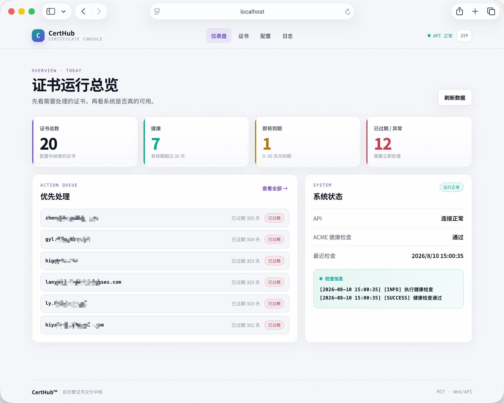

<div align="center">


# 把证书从签发管到真正上线

**CertHub 把申请、续期、部署和验收放进一本自托管台账。**<br>
能 SSH 的自动推，只能控制台上传的自动打包；上线前再检查完整证书链。

[产品主页](https://huiyonghkw.github.io/CertHub/) · [快速安装](https://huiyonghkw.github.io/CertHub/guide/install.html) · [完整文档](https://huiyonghkw.github.io/CertHub/guide/) · [版本与价格](https://huiyonghkw.github.io/CertHub/pricing.html)

[](LICENSE.md)
[](https://www.docker.com/)
[](https://letsencrypt.org/)
[](https://huiyonghkw.github.io/CertHub/)

</div>

---

## 签发只是半程，上线才是终点

acme.sh 已经很好地解决了“把证书申请下来”。真正麻烦的是后半程：域名散在不同日历、服务器、CDN 和云控制台里；有的目标能走 SSH，有的只能人工上传；浏览器看着正常，微信小程序却可能因为缺少中间证书而失败。

CertHub 将这些分散动作收进同一条工作流：

```text
申请证书 → 记录状态 → 自动续期 → SSH 部署 / 手动打包 → 完整链校验
```

[了解系统架构 →](https://huiyonghkw.github.io/CertHub/guide/architecture.html)

## 四个真正影响生产的环节

| 环节 | CertHub 做什么 | 结果 |
| --- | --- | --- |
| 完整链 | 优先使用 `fullchain.cer`，检查证书段数并探测线上主机 | 提前发现缺少中间证书的问题 |
| 自动部署 | SSH/SCP 推送证书并执行 nginx reload | 能 SSH 的目标自动完成交付 |
| 手动边界 | 为 CDN、云控制台等目标生成 ZIP/tar 包 | 不能自动推的场景也进入同一本台账 |
| 持续续期 | Cron 定期检查、续期、通知并重新部署 | 不再依赖个人日历记住到期日 |

[查看证书链指南](https://huiyonghkw.github.io/CertHub/guide/chain.html) · [查看 CDN 手动部署](https://huiyonghkw.github.io/CertHub/guide/cdn.html)

## Pro 控制台预览

<div align="center">
  <a href="https://huiyonghkw.github.io/CertHub/pricing.html">
    
  </a>
  <br>
  <sub>图中 Web 控制台与完整 REST API 属于 CertHub Pro，不包含在本 Community 仓库中。</sub>
</div>

## Community 与 Pro

Community 提供完整的 CLI 基础闭环；当证书数量增加、需要可视化操作面和自动化接口时，再升级 Pro。

| 能力 | Community | Pro |
| --- | :---: | :---: |
| 证书容量 | 5 张 | 10 / 50 / 200 张 |
| 中国大陆年付价格 | ¥0 | ¥99 / ¥199 / ¥499 |
| DNS-01 签发与续期 | ✓ | ✓ |
| SSH/SCP 自动部署 | ✓ | ✓ |
| 手动 ZIP 打包 | ✓ | ✓ |
| 完整证书链校验 | ✓ | ✓ |
| CLI + YAML | ✓ | ✓ |
| Web 仪表盘与证书操作 | — | ✓ |
| 在线配置与日志 | — | ✓ |
| 完整 REST API | 仅 `/health` | ✓ |

所有版本均为自托管。同一张证书部署到多台服务器，不重复计算证书槽位。

[查看完整版本对比与价格 →](https://huiyonghkw.github.io/CertHub/pricing.html)

## 快速开始

### 1. 克隆并准备配置

```bash
git clone https://github.com/huiyonghkw/CertHub.git
cd CertHub

cp config/domains.yml.example config/domains.yml
cp config/dns-providers.yml.example config/dns-providers.yml
cp config/servers.yml.example config/servers.yml
cp config/notify.yml.example config/notify.yml
```

### 2. 启动 Community

```bash
docker compose up -d acme-manager acme-health
docker compose ps
curl http://localhost:8080/health
```

### 3. 运行证书工作流

```bash
# 查看帮助
docker exec acme-ssl-manager /scripts/cert-manager.sh help

# 检查全部证书
docker exec acme-ssl-manager /scripts/cert-manager.sh status-all

# 续期即将到期的证书
docker exec acme-ssl-manager /scripts/cert-manager.sh renew-all

# 为手动上传目标打包
docker exec acme-ssl-manager /scripts/cert-manager.sh pack-manual

# 校验完整证书链
docker exec acme-ssl-manager /scripts/cert-manager.sh verify-chains
```

[打开完整安装教程 →](https://huiyonghkw.github.io/CertHub/guide/install.html)

## 一份配置管理三条路径

```yaml
domains:
  - domain: example.com
    wildcard: true
    dns_provider: aliyun
    servers:
      - server_prod_01
    subdomains:
      - domain: api.example.com
        deploy_method: auto
      - domain: cdn.example.com
        deploy_method: manual
```

- `auto`：SSH/SCP 推送到目标服务器并执行 reload。
- `manual`：跳过自动推送，生成适合控制台上传的压缩包。
- `verify-chains`：部署后探测线上域名，确认完整证书链。

[DNS 与域名配置说明 →](https://huiyonghkw.github.io/CertHub/guide/config.html)

## 支持范围

- 阿里云、腾讯云、华为云 DNS-01
- 单域名和泛域名证书
- ECC 与 RSA
- 多服务器 SSH/SCP 部署
- 邮件、钉钉、Webhook、Slack 通知
- Prometheus 可选监控
- Docker Compose 自托管

> DNS-01 解决域名验证，不等于云厂商证书上传 API。只能通过控制台上传证书的平台，应使用 `manual` 工作流。

## 安全边界

- 不要提交 DNS API 密钥、SSH 私钥、证书私钥或真实运行配置。
- 生产环境使用专用部署密钥和最小权限账号。
- Community 的 `8080` 端口只提供只读 `GET /health`。
- 本公开仓库不包含 Web 控制台、证书管理 API、商业授权文件或 Pro 私有实现。

[阅读安全说明 →](SECURITY.md)

## 文档导航

- [产品主页](https://huiyonghkw.github.io/CertHub/)
- [安装部署](https://huiyonghkw.github.io/CertHub/guide/install.html)
- [配置说明](https://huiyonghkw.github.io/CertHub/guide/config.html)
- [日常操作](https://huiyonghkw.github.io/CertHub/guide/daily.html)
- [证书链排查](https://huiyonghkw.github.io/CertHub/guide/chain.html)
- [CDN 手动部署](https://huiyonghkw.github.io/CertHub/guide/cdn.html)
- [故障排除](https://huiyonghkw.github.io/CertHub/guide/troubleshoot.html)
- [CertHub Pro](https://huiyonghkw.github.io/CertHub/pricing.html)

## 许可证

CertHub Community 使用 [MIT License](LICENSE.md)。该许可证只适用于本公开仓库实际发布的文件，不代表独立交付的 CertHub Pro 软件使用相同许可证。

---

<div align="center">

**先用 Community 跑通五张证书，再决定是否需要完整控制台。**

[免费开始](https://huiyonghkw.github.io/CertHub/guide/install.html) · [查看 Pro](https://huiyonghkw.github.io/CertHub/pricing.html) · [提交问题](https://github.com/huiyonghkw/CertHub/issues)

</div>
